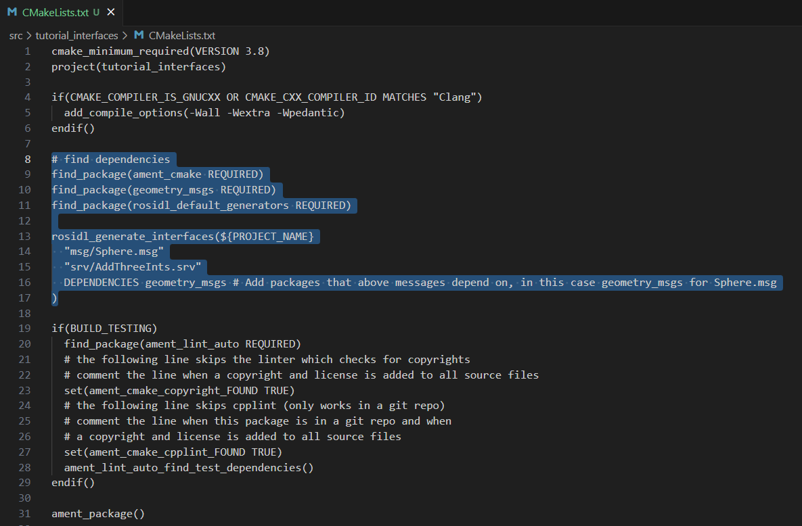
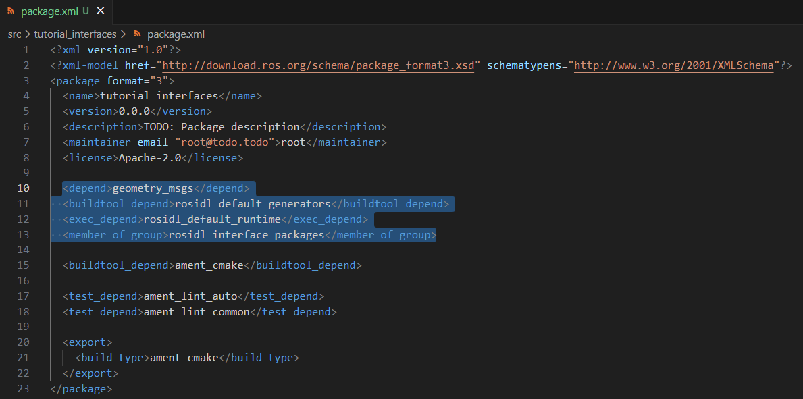

Creating custom msg and srv. Python
==========================

.. _custom msg and srv python:

In previous sections, predefined messages and service types were used. Recall the ``String`` message type in `the publisher and subscriber example`_ or the ``AddTwoInts`` service in the `service and client examples`_. These types of interfaces already existed and were ready to be used. In this section, custom messages and services types will be created and applied into program examples under the python programming language.

.. _`the publisher and subscriber example`: https://ros2course.readthedocs.io/en/latest/Writing%20publisher%20and%20subscriber%20nodes.%20Python.html#writing-publisher-and-subscriber-nodes-python
.. _`service and client examples`: https://ros2course.readthedocs.io/en/latest/Writing%20service%20and%20client.%20Python.html#writing-service-and-client-python

Setup for working with custom msg and srv
------------------------

Make sure to be in a `brand new terminal`_ window and no ROS command is currently running. 

.. _`brand new terminal`: https://ros2course.readthedocs.io/en/latest/Installation%20and%20software%20setup.html#running-a-docker-container

Create a new package. This package should be contained in the ``ros2_ws`` workspace, within its ``/src`` folder. The name provided to this new package will be ``tutorial_interfaces``. 

For more reference on package creation consult the `package creation`_ section.

.. _package creation: https://ros2course.readthedocs.io/en/latest/Configuring%20environment.html#creating-and-configuring-a-package

.. code-block:: console

   ros2 pkg create --build-type ament_cmake --license Apache-2.0 tutorial_interfaces

Notice that the package created, is a CMake package. This is where the custom messages and services will be stored, but these can be used in any kind of packages, python or C++ packages.

Next, create the folder: ``msg`` and ``srv`` inside ``ros2_ws/src/tutorial_interfaces``. This is where messages and services types will be stored respectively.

Message definition
-----------------------

Inside ``tutorial_interfaces/msg`` create a new file named ``Sphere.msg``. Edit the content of ``Sphere.msg`` to include:

.. code-block:: console

   geometry_msgs/Point center
   float64 radius

This custom message uses a message from another message package (``geometry_msgs/Point`` in this case).

Service definition
-----------------------

Inside ``tutorial_interfaces/srv`` create a new file named ``AddThreeInts.srv``. Edit the content of ``AddThreeInts.srv`` to include:

.. code-block:: console

   int64 a
   int64 b
   int64 c
   ---
   int64 sum

This custom service requests three integers named ``a``, ``b``, and ``c``, and responds with an integer called ``sum``.

Edditing the CMakeLists.txt
-----------------------

To convert the defined interfaces into language-specific code (like C++ and Python) so that they can be used in those languages, add the following lines to ``CMakeLists.txt``:

.. code-block:: console

   find_package(geometry_msgs REQUIRED)
   find_package(rosidl_default_generators REQUIRED)

   rosidl_generate_interfaces(${PROJECT_NAME}
   "msg/Sphere.msg"
   "srv/AddThreeInts.srv"
   DEPENDENCIES geometry_msgs # Add packages that above messages depend on, in this case geometry_msgs for Sphere.msg
   )

The ``find_package()`` commands make the compiler look for the required packages. In this case, ``geometry_msgs`` and ``rosidl_default_generators`` are the required packages.

The ``rosidl_generate_interfaces()`` command line, actually generates the code for the custom message and service interfaces. It takes as arguments: The name of the project, the path to the custom message and service files and necessary package dependencies.

The ``CMakeLists.txt`` file should look similar to:

Editing the package.xml file
-----------------------

The following should be added to ``tutorial_interfaces/package.xml``:

.. code-block:: console

   <depend>geometry_msgs</depend>
   <buildtool_depend>rosidl_default_generators</buildtool_depend>
   <exec_depend>rosidl_default_runtime</exec_depend>
   <member_of_group>rosidl_interface_packages</member_of_group>

- Because the interfaces rely on ``rosidl_default_generators`` for generating language-specific code, you need to declare a build tool dependency on it.
- ``rosidl_default_runtime`` is a runtime or execution-stage dependency, needed to be able to use the interfaces later.
- The ``rosidl_interface_packages`` is the name of the dependency group that the ``tutorial_interfaces package``, should be associated with, declared using the ``<member_of_group>`` tag.

The ``pacakge.xml`` file should look similar to:

Build and test
-----------------------

Open a `brand new terminal`_ , make sure that no other ROS 2 command is currently running, navigate to the workspace directory and execute:

.. code-block:: console

   colcon build --packages-select tutorial_interfaces

Now, source the setup file:

.. code-block:: console
   
   source install/setup.bash

For more reference on sourcing the setup file, see `sourcing the setup file`_.

.. _sourcing the setup file: https://ros2course.readthedocs.io/en/latest/Configuring%20environment.html#workspace-sourcing

Next, to check that the custom message is correctly created, run:

.. code-block:: console
   
   ros2 interface show tutorial_interfaces/msg/Sphere

The otuput should be: 

.. code-block:: console
   
   geometry_msgs/Point center
         float64 x
         float64 y
         float64 z
   float64 radius

And to test the service, run:

.. code-block:: console

   ros2 interface show tutorial_interfaces/srv/AddThreeInts

Should output the following:

.. code-block:: console

   int64 a
   int64 b
   int64 c
   ---
   int64 sum

Testing the Sphere custom msg in a python package
-----------------------
Make sure to be in a `brand new terminal`_ window and no ROS commands are currently running. 

Create a new python package,  this package should be contained in the ``ros2_ws`` workspace, within its ``/src`` folder. The name provided to this new package will be ``testing_interfaces_python``. For more reference on package creation consult the `package creation`_ section.

.. code-block:: console

   ros2 pkg create --build-type ament_python --license Apache-2.0 testing_interfaces_python --dependencies rclpy tutorial_interfaces

The ``--dependencies`` argument will automatically add the necessary dependency lines to ``package.xml``. In this case, ``tutorial_interfaces`` is the package that includes the ``Sphere.msg`` file that is needed for this test.

The code
~~~~~~~~~~~~~~~~

Next, inside ``testing_interfaces_python/testing_interfaces_python`` create a python script, name it ``sphere_publisher.py``. 

Copy this content into the new python script. 

.. code-block:: python

   import rclpy
   from rclpy.node import Node

   from tutorial_interfaces.msg import Sphere                                      # Change

   class SpherePublisher(Node):                                                    # Change

      def __init__(self):
         super().__init__('sphere_publisher')                                    # Change
         self.publisher_ = self.create_publisher(Sphere, 'sphere_topic', 10)     # Change
         timer_period = 0.5  # seconds
         self.timer_ = self.create_timer(timer_period, self.timer_callback)
         self.count_ = 0.0

      def timer_callback(self):
         msg = Sphere()                                                          # Change
         msg.center.x = self.count_                                              # Change    
         msg.center.y = 1.0                                                      # Change
         msg.center.z = 2.0                                                      # Change    
         msg.radius = 10.0                                                       # Change
         self.publisher_.publish(msg)                                            # Change
         self.get_logger().info('Publishing sphere params (x, y, z, radius):' +  # Change
                                 'x=%s, y=%s, z=%s, radius=%s' % 
                                 (msg.center.x, msg.center.y, msg.center.z, msg.radius))
         self.count_ += 1.0    

   def main(args=None):
      rclpy.init(args=args)

      sphere_publisher = SpherePublisher()

      rclpy.spin(sphere_publisher)

      # Destroy the node explicitly
      # (optional - otherwise it will be done automatically
      # when the garbage collector destroys the node object)
      sphere_publisher.destroy_node()
      rclpy.shutdown()

   if __name__ == '__main__':
      main()

Notice that this code is very similar to the `publisher script that was studied previously`_.

.. _`publisher script that was studied previously`: https://ros2course.readthedocs.io/en/latest/Writing%20publisher%20and%20subscriber%20nodes.%20Python.html#publisher-node-in-python

Check the important changes in this script.

.. code-block:: python

   from tutorial_interfaces.msg import Sphere                                      # Change
   ...
   self.publisher_ = self.create_publisher(Sphere, 'sphere_topic', 10)     # Change
   ...
   def timer_callback(self):
         msg = Sphere()                                                          # Change
         msg.center.x = self.count_                                              # Change    
         msg.center.y = 1.0                                                      # Change
         msg.center.z = 2.0                                                      # Change    
         msg.radius = 10.0                                                       # Change
         self.publisher_.publish(msg)

- It is important to correctly import the required libraries.
- The publisher node will now publish different type of messages and will also publish to a different topic. The topic name could have stayed the same, but it is better to name the topics accordingly.
- Finally, the callback function, instead of directly publishing a string message, it is necessary to fill every parameter that is needed for the new message type. 

Next, create another node a listener node for this publisher. Inside ``testing_interfaces_python/testing_interfaces_python`` create a python script, name it ``sphere_listener.py``. 

Copy this content into the new python script. 

.. code-block:: python

   import rclpy
   from rclpy.node import Node

   from tutorial_interfaces.msg import Sphere                                              # Change

   class SphereListener(Node):

      def __init__(self):
         super().__init__('sphere_listener')                                             # Change
         self.subscription_ = self.create_subscription(                                  # Change
               Sphere,
               'sphere_topic',
               self.listener_callback,
               10)
         self.subscription_  # prevent unused variable warning

      def listener_callback(self, msg):
         self.get_logger().info('I heard (x, y, z, radius):'+                            # Change
                                 'x=%s, y=%s, z=%s, radius=%s' %
                                 (msg.center.x, msg.center.y, msg.center.z, msg.radius))

   def main(args=None):
      rclpy.init(args=args)

      sphere_listener = SphereListener()

      rclpy.spin(sphere_listener)

      # Destroy the node explicitly
      # (optional - otherwise it will be done automatically
      # when the garbage collector destroys the node object)
      sphere_listener.destroy_node()
      rclpy.shutdown()

   if __name__ == '__main__':
      main()

The code is very similar to the `listener script that was studied previously`_.

.. _`listener script that was studied previously`: https://ros2course.readthedocs.io/en/latest/Writing%20publisher%20and%20subscriber%20nodes.%20Python.html#subscriber-node-in-python

Again, the relevant changes here, have to do with dealing with the appropriate topic name and message type. 

Dependencies and entry points
~~~~~~~~~~~~~~~~

Once, these two python scripts are ready, it is necessary to add the required dependencies in the ``package.xml`` file, which was already added when creating this package. See that in the ``package.xml`` file it is present the tag ``package.xml``: ``<depend>tutorial_interfaces</depend>``.

Next, add the entry points in the ``setup.py`` file:

.. code-block:: console

   entry_points={
         'console_scripts': [
               'sphere_publisher = testing_interfaces_python.sphere_publisher:main',
               'sphere_listener = testing_interfaces_python.sphere_listener:main'
         ],
      }

Build and run the custom msg
~~~~~~~~~~~~~~~~

Build the package with either of these commands:

.. code-block:: console

   colcon build --symlink-install
   colcon build --packages-select testing_interfaces_python

Source the setup file:

.. code-block:: console
   
   source install/setup.bash

And run the ``sphere_publisher`` node that was recently created. 

.. code-block:: console
   
   ros2 run testing_interfaces_python sphere_publisher

The result should be like the following:

.. code-block:: console
   
   [INFO] [1712658428.246483307] [sphere_publisher]: Publishing sphere params (x, y, z, radius):x=0.0, y=1.0, z=2.0, radius=10.0
   [INFO] [1712658428.603038612] [sphere_publisher]: Publishing sphere params (x, y, z, radius):x=1.0, y=1.0, z=2.0, radius=10.0
   [INFO] [1712658429.101586253] [sphere_publisher]: Publishing sphere params (x, y, z, radius):x=2.0, y=1.0, z=2.0, radius=10.0
   ...

`Open a new terminal`_ and execute the ``sphere_listener`` node:

.. _open a new terminal: https://ros2course.readthedocs.io/en/latest/Installation%20and%20software%20setup.html#opening-a-new-terminal-for-the-docker-container

.. code-block:: console
   
   ros2 run testing_interfaces_python sphere_listener

The expected result is:

.. code-block:: console
   
   [INFO] [1712658569.240308588] [sphere_listener]: I heard (x, y, z, radius):x=282.0, y=1.0, z=2.0, radius=10.0
   [INFO] [1712658569.597305674] [sphere_listener]: I heard (x, y, z, radius):x=283.0, y=1.0, z=2.0, radius=10.0
   [INFO] [1712658570.098490216] [sphere_listener]: I heard (x, y, z, radius):x=284.0, y=1.0, z=2.0, radius=10.0
   ...

Finally, it can also be checked the echo of the messages arriving to the desired topic. `Open a new terminal`_ and execute:

.. code-block:: console
   
   ros2 topic echo /sphere_topic

The expected result is:

.. code-block:: console
   
   x: 484.0
   y: 1.0
   z: 2.0
   radius: 10.0
   ---
   center:
   x: 485.0
   y: 1.0
   z: 2.0
   radius: 10.0
   ---
   ...

At this point, it can be seen that the custom message ``Sphere.msg`` that was created is being used successfully.

Testing the AddThreeInts custom srv in a python package
-----------------------

This example will be worked in the ``testing_interfaces_python`` package.

Make sure to be in a `brand new terminal`_ window and no ROS commands are currently running.

The code
~~~~~~~~~~~~~~~~

Inside ``testing_interfaces_python/testing_interfaces_python`` create a python script, name it ``add_service_node.py``. 

Copy this content into the new python script. 

.. code-block:: python

   from tutorial_interfaces.srv import AddThreeInts

   import rclpy
   from rclpy.node import Node

   class AdditionService(Node):

      def __init__(self):
         super().__init__('add_service_node')
         self.srv = self.create_service(AddThreeInts, 'add_three_ints', self.add_three_ints_callback)

      def add_three_ints_callback(self, request, response):
         response.sum = request.a + request.b + request.c
         self.get_logger().info('Incoming request\na: %d b: %d c: %d' % (request.a, request.b, request.c))

         return response

   def main():
      rclpy.init()

      addition_service = AdditionService()

      rclpy.spin(addition_service)

      rclpy.shutdown()

   if __name__ == '__main__':
      main()

Notice that this code is very similar to the `service script that was studied previously`_.

.. _`service script that was studied previously`: https://ros2course.readthedocs.io/en/latest/Writing%20service%20and%20client.%20Python.html#writing-the-service-node-python

Check the important changes in this script.

.. code-block:: python

   from tutorial_interfaces.srv import AddThreeInts
   ...
   self.srv = self.create_service(AddThreeInts, 'add_three_ints', self.add_three_ints_callback)
   ...
   def add_three_ints_callback(self, request, response):
         response.sum = request.a + request.b + request.c
         self.get_logger().info('Incoming request\na: %d b: %d c: %d' % (request.a, request.b, request.c))

         return response

- It is important to correctly import the required service.
- The service node will now be of type ``AddThreeInts``, and the a service name of: ``add_three_ints``. 
- Finally, the callback function, instead of adding two values it will summ the three parameters in the request section of the service. 

Next, create a client node for this service. Inside ``testing_interfaces_python/testing_interfaces_python`` create a python script, name it ``add_client_node.py``. 

Copy this content into the new python script. 

.. code-block:: python

   import sys

   import rclpy
   from rclpy.node import Node
   from tutorial_interfaces.srv import AddThreeInts

   class AdditionClientAsync(Node):

      def __init__(self):
         super().__init__('add_client_node')
         self.cli = self.create_client(AddThreeInts, 'add_three_ints')
         while not self.cli.wait_for_service(timeout_sec=1.0):
               self.get_logger().info('service not available, waiting again...')
         self.req = AddThreeInts.Request()

      def send_request(self, a, b, c):
         self.req.a = a
         self.req.b = b
         self.req.c = c
         self.future = self.cli.call_async(self.req)
         rclpy.spin_until_future_complete(self, self.future)
         return self.future.result()

   def main():
      rclpy.init()

      add_client = AdditionClientAsync()
      response = add_client.send_request(int(sys.argv[1]), int(sys.argv[2]), int(sys.argv[3]))
      add_client.get_logger().info(
         'Result of add_three_ints: for %d + %d + %d = %d' %
         (int(sys.argv[1]), int(sys.argv[2]), int(sys.argv[3]), response.sum))

      add_client.destroy_node()
      rclpy.shutdown()

   if __name__ == '__main__':
      main()

The code is very similar to the `service client script that was studied previously`_.

.. _`service client script that was studied previously`: https://ros2course.readthedocs.io/en/latest/Writing%20service%20and%20client.%20Python.html#client-node-in-python

Again, the relevant changes here, have to do with dealing with the appropriate service name and service type. 

Dependencies and entry points
~~~~~~~~~~~~~~~~

Once, these two python scripts are ready, it is necessary to add the required dependencies in the ``package.xml`` file, which was already added when creating this package. See that in the ``package.xml`` file it is present the tag ``package.xml``: ``<depend>tutorial_interfaces</depend>``.

Next, add the entry points in the ``setup.py`` file:

.. code-block:: console

   entry_points={
         'console_scripts': [
               'sphere_publisher = testing_interfaces_python.sphere_publisher:main',
               'sphere_listener = testing_interfaces_python.sphere_listener:main',
               'add_service_node = testing_interfaces_python.add_service_node:main',
               'add_client_node = testing_interfaces_python.add_client_node:main',

         ],
      },

Build and run the custom srv
~~~~~~~~~~~~~~~~

Build the package with either of these commands:

.. code-block:: console

   colcon build --symlink-install
   colcon build --packages-select testing_interfaces_python

Source the setup file:

.. code-block:: console
   
   source install/setup.bash

And run the ``add_service_node`` node that was recently created. 

.. code-block:: console
   
   ros2 run testing_interfaces_python add_service_node

As a result, nothing will be printed in the terminal. The service is ready to be consumed. 

`Open a new terminal`_ and execute the ``add_client_node`` node:

.. code-block:: console
   
   ros2 run testing_interfaces_python add_client_node 4 5 8

The expected result is:

.. code-block:: console
   
   [INFO] [1712660818.668964970] [add_client_node]: Result of add_three_ints: for 4 + 5 + 8 = 17

Finally, the ``add_three_ints service`` can also be called from the terminal directly, without the necessity of coding a client node. `Open a new terminal`_ and execute:

.. code-block:: console
   
   ros2 service call /add_three_ints tutorial_interfaces/srv/AddThreeInts "{a: 2, b: 3, c: 5}"

The expected result is:

.. code-block:: console
   
   requester: making request: tutorial_interfaces.srv.AddThreeInts_Request(a=2, b=3, c=5)

   response:
   tutorial_interfaces.srv.AddThreeInts_Response(sum=10)

At this point, it can be seen that the custom service ``AddThreeInts.srv`` that was created is being used successfully.