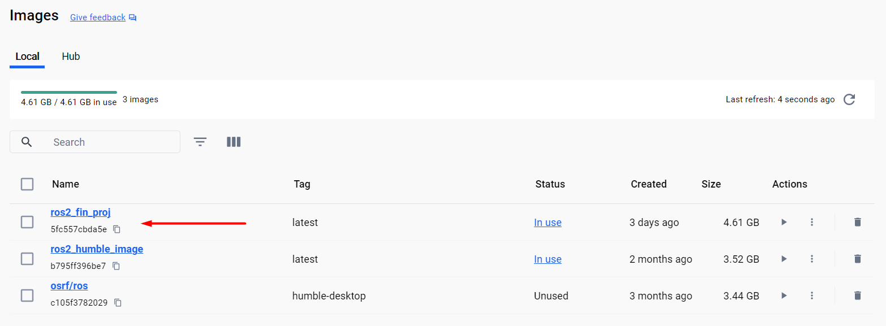
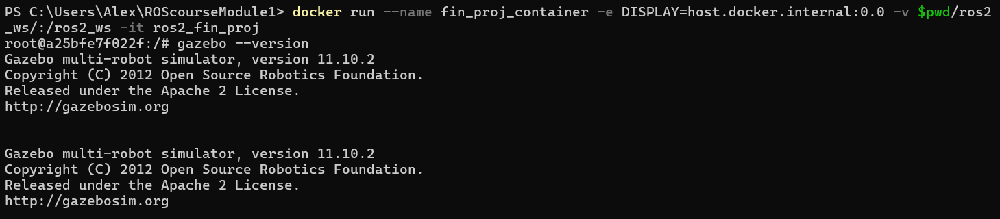
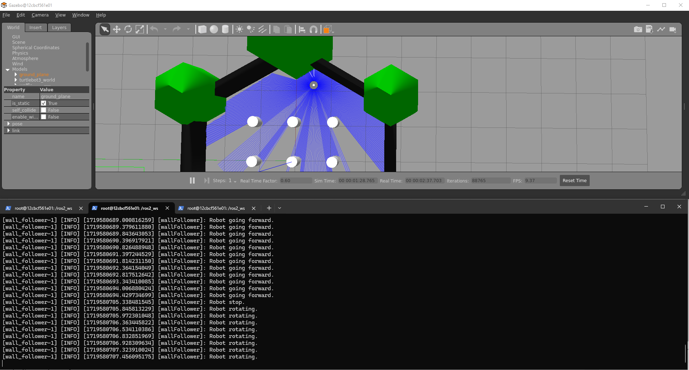

Final project
=====

.. _final_project:

Setting up 
------------

To work in the final project it will be necessary to install packages to the current ROS 2 environment. 

As it is known, when working with Docker, the changes performed in a container during a session, aren’t automatically preserved within the container once the session ends; unless, of course, a new session is created pointing to the exact same container. This is why a new Docker file, with the required commands to install all packages, is to be generated. 

Recall from `this section of the course`_ that the Docker file was used for generating a Docker image from which later, a Docker container will be created which is finally where the ROS 2 final project development is going to be held. 

.. _this section of the course: https://ros2course.readthedocs.io/en/latest/Configuring%20environment.html#the-dockerfile-script-explained

Having stated the reason for creating a new Docker image, navigate to the ``Dockerfile`` file that was created at the beginning of the course and add the following to it.

.. code-block:: console

   RUN sudo apt-get update
   RUN sudo apt install ros-humble-gazebo-* -y
   RUN sudo apt install ros-humble-cartographer -y
   RUN sudo apt install ros-humble-cartographer-ros -y
   RUN sudo apt install ros-humble-navigation2 -y
   RUN sudo apt install ros-humble-nav2-bringup -y
   RUN bash -c "source ~/.bashrc"
   RUN sudo apt install ros-humble-dynamixel-sdk -y
   RUN sudo apt install ros-humble-turtlebot3-msgs -y
   RUN sudo apt install ros-humble-turtlebot3 -y
   RUN sudo apt-get install ros-humble-turtlebot3-gazebo -y

The complete ``Dockerfile`` should look like this:

.. code-block:: console

   FROM osrf/ros:humble-desktop

   RUN apt-get update && apt-get install -y nano && apt-get install tree 
   RUN apt install -y python3-pip
   RUN apt-get install dos2unix
   RUN pip3 install setuptools==58.2.0
   RUN echo "source /opt/ros/humble/setup.bash" >> ~/.bashrc

   RUN sudo apt-get update
   RUN sudo apt install ros-humble-gazebo-* -y
   RUN sudo apt install ros-humble-cartographer -y
   RUN sudo apt install ros-humble-cartographer-ros -y
   RUN sudo apt install ros-humble-navigation2 -y
   RUN sudo apt install ros-humble-nav2-bringup -y
   RUN bash -c "source ~/.bashrc"
   RUN sudo apt install ros-humble-dynamixel-sdk -y
   RUN sudo apt install ros-humble-turtlebot3-msgs -y
   RUN sudo apt install ros-humble-turtlebot3 -y
   RUN sudo apt-get install ros-humble-turtlebot3-gazebo -y

Once the ``Dockerfile`` is modified, let's generate a Docker image out of it. Go to the Windows terminal and navigate to the folder that contains the ``Dockerfile`` file and execute:

.. code-block:: console

   docker image build -t ros2_fin_proj .

Alternativelly, this command can be executed with Docker not using its caching mechanism, building every step from scratch, ensuring that all commands are executed anew.

.. code-block:: console

   docker image build --no-cache -t ros2_fin_proj .

Either of these commands will create a Docker image based on the ``Dockerfile``. The name assigned to the Docker image will be: ``ros2_fin_proj``.

Next, this Docker image will be the base for creating a Docker container which is where the final project programming will be carried on. To create a container from this Docker image, follow the instruction on `this section`_  of the course, but launching the container with this different command:

.. _`this section`: https://ros2course.readthedocs.io/en/latest/Installation%20and%20software%20setup.html#running-a-docker-container

.. code-block:: console

   docker run --name fin_proj_container -e DISPLAY=host.docker.internal:0.0 -v $pwd/ros2_ws/:/ros2_ws -it ros2_fin_proj

- See that the name assigned to the container (``fin_proj_container``) is consistent with the Docker image (``ros2_fin_proj``) that it is used to generate it. 

Once the container is launched, it can be tested that gazebo is installed. Execute this command in the terminal:

.. code-block:: console

   gazebo --version

An output similar to this should appear in the terminal.

.. code-block:: console

   Gazebo multi-robot simulator, version 11.10.2
   Copyright (C) 2012 Open Source Robotics Foundation.
   Released under the Apache 2 License.
   http://gazebosim.org

   Copyright (C) 2012 Open Source Robotics Foundation.
   Released under the Apache 2 License.
   http://gazebosim.org

Next, to correctly be able to work with the final project environment, source the gazebo setup file:

.. code-block:: console

   source /usr/share/gazebo/setup.sh 

This command sets up various environment variables needed for Gazebo to function properly; These variables may include paths to Gazebo libraries, plugins, and other resources.

Additionally, navigate to the workspace folder and source the workspace setup file:

.. code-block:: console

   source install/setup.bash 

For more reference on sourcing the setup file, see `sourcing the setup file`_.

.. _sourcing the setup file: https://ros2course.readthedocs.io/en/latest/Configuring%20environment.html#workspace-sourcing

Finally, execute these commands to launch the Gazebo enviroment for the final project. 

.. code-block:: console

   export TURTLEBOT3_MODEL=waffle
   ros2 launch turtlebot3_gazebo turtlebot3_world.launch.py

Up to this point the Gazebo enviroment is ready to be worked on for the final project programming. 

Working in the Gazebo environment  
------------

There are a few tools and executables that could help with the development of the final project. In order to use them, make sure the Gazebo environment with the turtlebot3 robot in it, is already executed (the ``ros2 launch turtlebot3_gazebo turtlebot3_world.launch.py`` command of the previous section).

Remote control of the turlebot3 
~~~~~~~~~~~~~

First, turtlebot3 robot in the Gazebo environment can be remote-controlled by the user.  `Open a new terminal`_, making sure to point to the final project container: 

.. _open a new terminal: https://ros2course.readthedocs.io/en/latest/Installation%20and%20software%20setup.html#opening-a-new-terminal-for-the-docker-container

.. code-block:: console

   docker exec -it fin_proj_container bash

And once inside the ``fin_proj_container`` container in the new terminal, execute:

.. code-block:: console
   
   source /usr/share/gazebo/setup.sh 
   export TURTLEBOT3_MODEL=waffle
   ros2 run turtlebot3_teleop teleop_keyboard

With this node executed, it is possible to control the motion of the turtlebot3 robot. Forward, backward and angular velocities can be commanded throught the keyboard and the robot will respond accordingly.

rqt_gui tool
~~~~~~~~~~~~~

Additionally, there is a graphical tool that enables visualization of the lectures obtained from the turlebot3 lidar sensor. `Open a new terminal`_, making sure to point to the final project container, and execute:

.. code-block:: console
   
   ros2 run rqt_gui rqt_gui

An rqt_gui window will be opened. Select the ``Plugins>visualization>Plot`` option.

In the ``rqt_gui`` window, inside the ``topics`` textbox select the lidar laser measurements that are of interest. See the example below, the lasers at 359 and 270 positions were selected.

As a result, the distance measurements corresponding to laser beams in position 359 (in front of the robot) and 270 (right side of the robot), are shown in a single plot. 

Statement of the final project
------------

The final project's objective is to make the turtlebot3 robot, in the given Gazebo environment, go straight for a while and begin following the wall until one complete turn is performed, without crashing with it. 

This is where the turtlebot3 robot is spawned in the Gazebo environment. 

Make the robot advance in a straight line until it gets close to the wall in front of it (at around 0.3 units of distance from it). 

From that point begin following the walls until making a complete turn around the entire Gazebo environment. The turn direction can be selected by the programmer, either clock or counter-clock wise turn.

At every moment of the robot motion, print through the terminal the operation that it is performing:

- Robot going forward. 
- Robot stop. 
- Robot rotating. 
- Robot approaching wall with linear and angular velocity: <current linear vel>, <current ang vel>
- Robot getting away from the wall with linear and angular velocity: <current linear vel>, <current ang vel>

And any other operation that the programmer thinks necessary. 

The execution of the final project must be contained in a single launch file. All nodes that the programmer believes necessary must be contained in a single launch file. 

IMPORTANT
------------

To submit the presentation for this final project, please use the following link: https://classroom.github.com/a/lC5Wabpd.

**Submission Deadline**: Sunday, August 18th.

Please refer to the guidelines provided in the link for detailed instructions on completing and submitting your final project.

