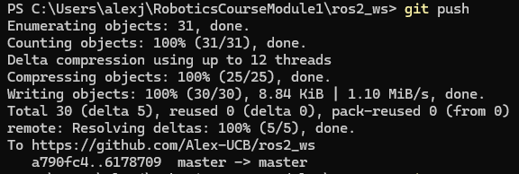
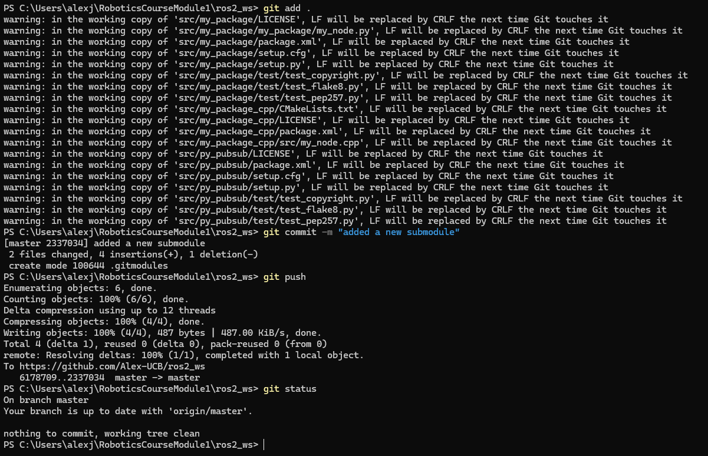
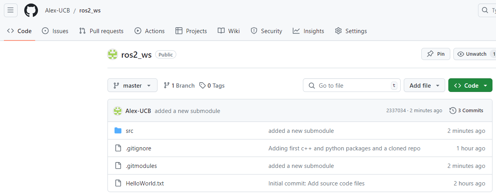

Github usage
=======================

.. _github_usage:

Pushing changes into remote repository
------------------------

At this point of the course, the workspace that was created (``ros2_ws``), already contains some code that can be pushed into the remote repository that was created, so this code is not only stored in one's local PC but in each one's GitHub account that can be accessed from any place with internet connection. And adding on top of it, the versioning control that GitHub provides. 

To perform the publishing of the code to one's Github repository, navigate in a Windows terminal, to the folder of the workspace and do:

.. code-block:: console

   git status

This will indicate the status of the local machine with respect to the remote repository. The output of executing the above command should be similar to this:

.. code-block:: console

   On branch master
   Your branch is up to date with 'origin/master'.

   Untracked files:
   (use "git add <file>..." to include in what will be committed)
         build/
         install/
         log/
         src/

   nothing added to commit but untracked files present (use "git add" to track)

See that there are untracked files in the local machine that would need to be first tracked, commited and pushed into the remote repository. 

Before adding these changes, create a new file called ``.gitignore`` in the workspace folder, and fill its content with the following:

.. code-block:: console

   build/
   install/
   log/

The ``.gitignore`` file specifies intentionally untracked files that Git should ignore. This helps avoid committing temporary or build-specific files into the repository. Meaning that for this particular example, Git will ignore to track files that are inside the ``build/``, ``install/`` and ``log/`` directories. If ``git status`` command is issued again in the Windows terminal, the output will be:

.. code-block:: console

   On branch master
   Your branch is up to date with 'origin/master'.

   Untracked files:
   (use "git add <file>..." to include in what will be committed)
         .gitignore
         src/

   nothing added to commit but untracked files present (use "git add" to track)

See that, the indicated folders are no longer in the list of untracked files, these folders will be simply ignored by Git.

Next, it is necessary to track all these changes. To do so, perform:

.. code-block:: console

   git add .

This command will track all untracked files. After adding all changes, perform ``git status`` command again. 

Notice that the changes performed in the cloned repository ``ros_tutorials``, were not added or staged for commit. This is because the code of this part belongs to a third person, this repository was cloned from a third person and the changes that one is performing over that repository cannot be pushed into that repository. More on this matter, later in this tutorial.

After adding the changes in the workspace, it is necessary to commit them. Perform:

.. code-block:: console

   git commit -m "Adding first c++ and python packages and a cloned repo"

It saves the current changes in the staging area to the repository with a descriptive message. This creates a new snapshot of the project's history, allowing the user to track and revert changes.

And finally type:

.. code-block:: console

   git push

It is probable that after executing this command, a Git Credentials manager window appears asking which Github account to use. 

The above image shows a case where two Github accounts are configured. If this is not the case of the participant of the course, then the Git credentials window will ask to enter the credentials for the unique Github account. Input the correspondant credentials and continue. 

And if one navigates to his/her Github repository, one could see that the pushed files exist there.

If executing ``git status`` in the Windows terminal again, the following will be shown:

Notice that there is still not-staged changes. These changes correspond to `this part of the course`_ where the label of the turtlesim window was changed to ``ROS2_course_TurtleSim``.

.. _this part of the course: https://ros2course.readthedocs.io/en/latest/Configuring%20environment.html#workspace-sourcing

Verify also how the cloned repository is shown in the Github repository of the user. 

The modified code of the cloned repo will not be able to be pushed into the user's remote repository. However, as this specific cloned repository (``ros_tutorials``) was intended for examples purposes only, it won't be necessary to have this change allocated in the remote repository.

Optional: Properly work with cloned repositories
------------------------

As an optional configuration to be performed in one's remote repository to be able to correctly work with cloned repositories, this set of steps ws prepared.

First, in a web browser go to the repository to be cloned. In this case it was https://github.com/ros/ros_tutorials, and fork the repository into a new own repository.

As seen in the image above, make sure to uncheck the ``Copy the noetic-devel branch only`` option and click on ``Create fork``. This, because the specific repository that is intended to clone has several branches in it, and the ``humble`` branch is the one the participant is interested in. 

Forking a repository creates a personal copy of someone else's project on one's GitHub account, allowing independent development; pushing changes to this forked repository is now possible since the repository now exists in one's Github account. While on the other hand, cloning copies a repository to one's local machine, enabling local development and changes if only if the appropriate permissions are configured. For example, one repository could add contribuitors to it, and if some Github account is under the contribuitors of a repository, then that particular Github account can push changes to it, otherwise it will not able to. 

As a result of the forking, the participant's Gtihub account will now have one more repository that corresponds to the forked repository which should look like the following:

Now, being in a Windows terminal, navigate to ``<workspace_folder>/src`` and delete the cloned repository called ``ros_tutorials``. Then, make sure to clean up the index and remove any lingering references to the deleted repository; execute this command:

.. code-block:: console

   git rm --cached -r

Next, create a Github submodule. Execute the following:

.. code-block:: console

   git submodule add https://github.com/Alex-UCB/ros_tutorials ros_tutorials

A Git submodule is a repository embedded within another repository, allowing the user to include and manage dependencies or libraries as part of a main project. This setup keeps the histories of the main project and submodules separate.

As a result of the git submodule addition, there should exist one extra file in the workspace, a file called ``.gitmodules``. 

In the Windows terminal, navigate to the ``ros_tutorials`` folder and execute:

.. code-block:: console

   git status

See that the submodule is pointing to the ``noetic-devel`` branch of the repository. It is necessary to change to a ``humble`` branch since that is the ROS 2 distribution that is being used in the course. Execute:

.. code-block:: console

   git checkout humble

Now that the correct branch is selected, it is necessary to fetch to the remote repository and pull all the content of this new branch into the local machine. Execute:

.. code-block:: console

   git fetch
   git pull

``git fetch`` updates the local repository with the latest changes from the remote repository without merging them into the working branch, while ``git pull`` fetches the latest changes from the remote repository and immediately merges them into your current working branch.

Now, perform the changes in the ``turtleframe.cpp`` file as `indicated in this section`_ of the course. 

.. _`indicated in this section`: https://ros2course.readthedocs.io/en/latest/Configuring%20environment.html#workspace-sourcing

Test that the modification works correctly. Open a `brand new terminal`_ of a Docker container, and perform the building of the workspace. But before building the workspace, delete the ``log/``, ``build/`` and ``install/`` folders from the workspace; for this, navigate to the workspace folder and execute the following:

.. _`brand new terminal`: https://ros2course.readthedocs.io/en/latest/Installation%20and%20software%20setup.html#running-a-docker-container

.. code-block:: console

   rm -rf build/ log/ install/

Now, the workspace can be built. In the Docker container, having navigated to the workspace folder, execute:

.. code-block:: console

   colcon build

Go to a Windows terminal, and navigate to ``<workspace_folder_path>/src/ros_tutorials`` and execute:

.. code-block:: console

   git status

Perform:

.. code-block:: console

   git add .
   git commit -m "Changed the name of the turtlesim frame"
   git push

If requested, enter the Gtihub credentials in the Git credentials manager window that appears. These last commands succesfully publish the changes made in the submodule repository. Check the remote forked repository.

Now, navigate to ``<workspace_folder_path>/`` and execute:

.. code-block:: console

   git status

See that the changes correspond to the elimination of the folders ``log/``, ``build/``, ``install/`` and the previously cloned repo ``src/ros_tutorials``, and the addition of the submodule ``src/ros_tutorials``. 

Now, perform the addition, commision and pushing of the changes to the remote workspace repository.

Check the status of the remote reposistory of the workspace.

This is the correct way to work with repositories inside other repositories, using Git submodules. Now, every change that is being made into the ``ros_tutorials`` package, needs to be pushed into its correspondant remote repository while being in the ``<workspace_folder_path>/src/ros_tutorials`` path, and all chagnes that refer to the workspace repository should be performed from the ``<workspace_folder_path>`` path.
