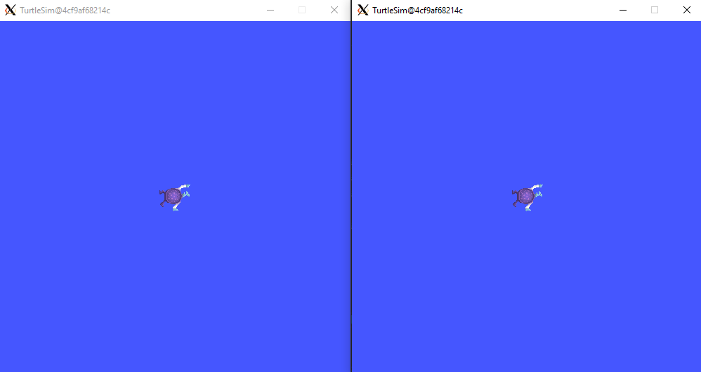
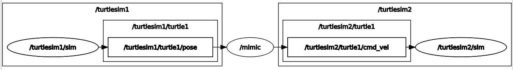
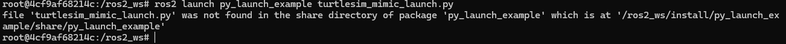
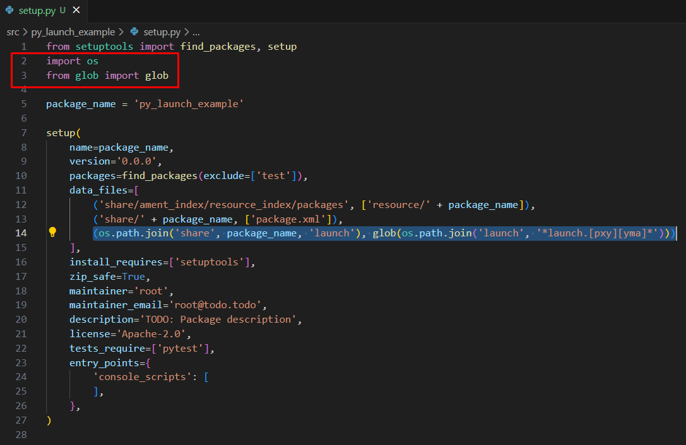
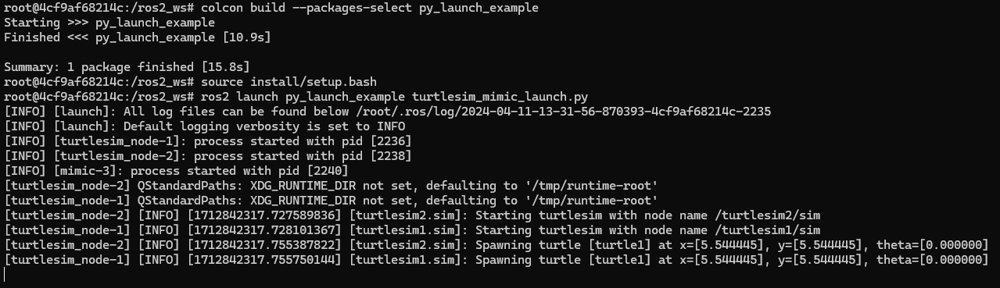
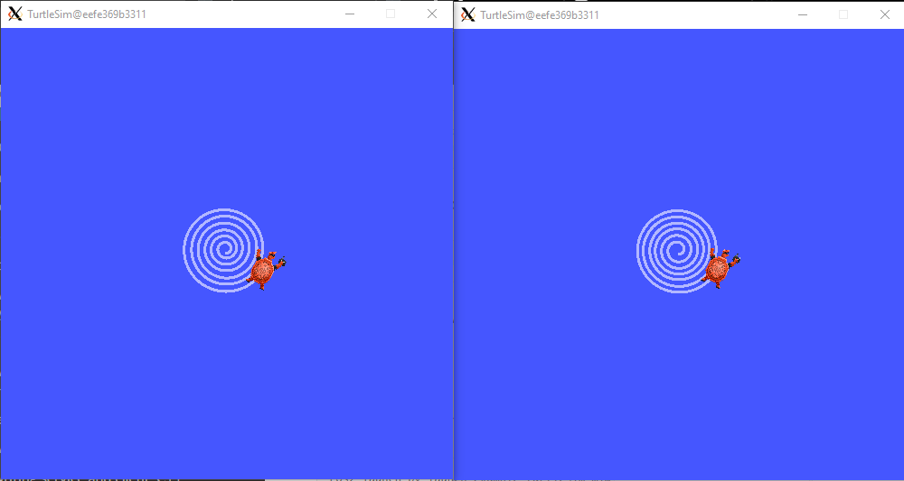

Launch files
=====

.. _launch files:

What is a launch file?
----------------

- Launch files provide a convenient way to organize and manage the launch process of a ROS 2 application, simplifying the initialization of complex robotic systems.
- Allows to specify which nodes should be started and with which parameters. This includes specifying the node name, package name, executable name, and any parameters that need to be passed to the node
- Launch files support the use of namespaces for nodes, which helps in organizing and structuring your ROS 2 system.
- Allows to remap topics, services, and parameters, providing flexibility in connecting nodes together.
- Other launch files can be included within a launch file, facilitating modularization and reuse of launch configurations.

Do not forget 
-------------
Remember to have your environment properly setup. Perform the following, if the ROS 2 package cannot be found when executing it:

.. code-block:: console

   source install/setup.sh

See this example: 

- Look at the error of not being able to find the desired package. This is because the workspace was not configured correctly.

.. image:: images/errorNotSourcing.png
   :alt: Error message of not sourcing workspace correctly.

- Source the appropriate setup script to correctly configure the environment.

.. image:: images/sourcingWorkspace.png
   :alt: Correctly sourcing the workspace.

Notice that the sourcing is performed inside the workspace folder. More information on sourcing the environment, `check it here`_.

.. _check it here: https://ros2course.readthedocs.io/en/latest/Configuring%20environment.html#workspace-sourcing

Running a launch file 
--------------------------

Make sure to be in a `brand new terminal`_ window and no ROS command is currently running. 

.. _`brand new terminal`: https://ros2course.readthedocs.io/en/latest/Installation%20and%20software%20setup.html#running-a-docker-container

This is the structure to run a launch file:

.. code-block:: console

   ros2 launch <package_name> <launch_file_name.launch.py>

However, it is also possible to write launch files in ``.xml`` or ``.yaml`` formats rather than ``.py`` scripts. But for this course only ``.py`` scripts for launch files will be explained.

See the following example of a launch file execution:

.. code-block:: console

   ros2 launch turtlesim multisim.launch.py

This will run two turtlesim nodes:

It can be further inspected the ``multisim.launch.py`` file. This is its content:

.. code-block:: python

   # turtlesim/launch/multisim.launch.py

   from launch import LaunchDescription
   import launch_ros.actions

   def generate_launch_description():
      return LaunchDescription([
         launch_ros.actions.Node(
               namespace= "turtlesim1", package='turtlesim', executable='turtlesim_node', output='screen'),
         launch_ros.actions.Node(
               namespace= "turtlesim2", package='turtlesim', executable='turtlesim_node', output='screen'),
      ])

The code details will be addressed in the next section of this tutorial.

Creating a launch file
------------------

Make sure to be in a `brand new terminal`_ window and no ROS command is currently running.

Create a new package. This package should be contained in the ``ros2_ws`` workspace, within its ``/src`` folder. The name provided to this new package will be ``py_launch_example``. For more reference on package creation consult the `package creation`_ section.

.. _package creation: https://ros2course.readthedocs.io/en/latest/Configuring%20environment.html#creating-and-configuring-a-package

.. code-block:: console

   ros2 pkg create --build-type ament_python --license Apache-2.0 py_launch_example

Next, create a ``launch`` folder inside ``ros2_ws/src/py_launch_example``. This is where the launch file scripts will be stored.

Inside ``py_launch_example/launch`` create a new file named ``turtlesim_mimic_launch.py``. Edit the content of ``turtlesim_mimic_launch.msg`` to include:

.. code-block:: python

   from launch import LaunchDescription
   from launch_ros.actions import Node

   def generate_launch_description():
      return LaunchDescription([
         Node(
               package='turtlesim',
               namespace='turtlesim1',
               executable='turtlesim_node',
               name='sim'
         ),
         Node(
               package='turtlesim',
               namespace='turtlesim2',
               executable='turtlesim_node',
               name='sim'
         ),
         Node(
               package='turtlesim',
               executable='mimic',
               name='mimic',
               remappings=[
                  ('/input/pose', '/turtlesim1/turtle1/pose'),
                  ('/output/cmd_vel', '/turtlesim2/turtle1/cmd_vel'),
               ]
         )
      ])

Explaining the code
~~~~~~~~~~~~~~~~

First, some libraries import:

.. code-block:: python

   from launch import LaunchDescription
   from launch_ros.actions import Node

- ``from launch import LaunchDescription``: This line imports the ``LaunchDescription`` class from the ``launch`` package. The ``LaunchDescription`` class is a key component in ROS 2 launch files. It is used to define the structure and contents of a launch file. When a launch file is created in ROS 2, an instance of ``LaunchDescription`` is typically created and various actions (such as starting nodes) are added to it.
- ``from launch_ros.actions import Node``: This line imports the ``Node`` class from the ``launch_ros.actions`` module. The ``Node`` class is a specialized action in ROS 2 launch files that is used to start a ROS 2 node. To execute a node in a launch file, an instance of ``Node`` is created and the package name, executable name, node name, and any parameters or remappings that are needed for the node are specified.

Next, a function defintion:

.. code-block:: python

   def generate_launch_description():
      return LaunchDescription([
         Node(
               package='turtlesim',
               namespace='turtlesim1',
               executable='turtlesim_node',
               name='sim'
         ),
         Node(
               package='turtlesim',
               namespace='turtlesim2',
               executable='turtlesim_node',
               name='sim'
         ),
         Node(
               package='turtlesim',
               executable='mimic',
               name='mimic',
               remappings=[
                  ('/input/pose', '/turtlesim1/turtle1/pose'),
                  ('/output/cmd_vel', '/turtlesim2/turtle1/cmd_vel'),
               ]
         )
      ])

- This function returns a ``LaunchDescription`` object, which contains all the actions (in this case, node launches) to be performed when the launch file is executed.
- ``Node(...)`` : This line starts the definition of a ROS 2 node to be launched.
    - The ``package``, ``namespace``, ``executable`` and ``name`` parameters are specified.
- It executes three nodes: 
    - Two nodes from the ``turtlesim_node`` executable file; each one with a different namespace name.
    - And one node from the ``mimic`` executable file.   
- At the moment of executing the ``mimic`` node two remap actions are performed:
    - ``/input/pose``, which is the topic that ``mimic`` node is initially subscribed to, is now remapped to ``/turtlesim1/turtle1/pose``, meaning that the ``mimic`` node is now subscribed to ``/turtlesim1/turtle1/pose``, which happens to be the ``pose`` topic to which the first turtle simulation publishes messages to.
    - ``/output/cmd_vel`` topic, which is the topic that the ``mimic`` node initially published to, is now remapped to ``/turtlesim2/turtle1/cmd_vel``, meaning that the ``mimic`` node is now publishing to ``/turtlesim2/turtle1/cmd_vel``, which happens to be the ``cmd_vel`` topic to which the second turtle simulation is subscribed to.

Test the launch file
~~~~~~~~~~~~~~~~

Navigate to ``py_launch_example/launch`` and execute the following:

.. code-block:: console

   ros2 launch turtlesim_mimic_launch.py

This will open two turtlesim node windows, where the same turtle is spawned in each window. It will also be seen a similar output in the terminal:

.. code-block:: console

   [INFO] [launch]: All log files can be found below /root/.ros/log/2024-04-11-12-24-49-571023-4cf9af68214c-1556
   [INFO] [launch]: Default logging verbosity is set to INFO
   [INFO] [turtlesim_node-1]: process started with pid [1557]
   [INFO] [turtlesim_node-2]: process started with pid [1559]
   [INFO] [mimic-3]: process started with pid [1561]
   [turtlesim_node-1] QStandardPaths: XDG_RUNTIME_DIR not set, defaulting to '/tmp/runtime-root'
   [turtlesim_node-2] QStandardPaths: XDG_RUNTIME_DIR not set, defaulting to '/tmp/runtime-root'
   [turtlesim_node-1] [INFO] [1712838290.327688850] [turtlesim1.sim]: Starting turtlesim with node name /turtlesim1/sim
   [turtlesim_node-2] [INFO] [1712838290.328043552] [turtlesim2.sim]: Starting turtlesim with node name /turtlesim2/sim
   [turtlesim_node-1] [INFO] [1712838290.357751302] [turtlesim1.sim]: Spawning turtle [turtle1] at x=[5.544445], y=[5.544445], theta=[0.000000]
   [turtlesim_node-2] [INFO] [1712838290.358168704] [turtlesim2.sim]: Spawning turtle [turtle1] at x=[5.544445], y=[5.544445], theta=[0.000000]

Indicating that the two turtlesim nodes have been initiated.

Next, in `a new terminal`_, execute:

.. _a new terminal: https://ros2course.readthedocs.io/en/latest/Installation%20and%20software%20setup.html#opening-a-new-terminal-for-the-docker-container

.. code-block:: console

   rqt_graph

This will show how the mimic node is linking the two turtlesim nodes; it subscribes to ``/turtlesim1/turtle1/pose`` which corresponds to the first turtle simulation and publishes to ``/turtlesim2/turtle1/cmd_vel`` which affects the second turtle simulation.

Now, in `a new terminal`_, execute:

.. code-block:: console

   ros2 topic pub -r 1 /turtlesim1/turtle1/cmd_vel geometry_msgs/msg/Twist "{linear: {x: 2.0, y: 0.0, z: 0.0}, angular: {x: 0.0, y: 0.0, z: -1.8}}"

And see that both turtles move towards the same direction.

Observations on this launch file
~~~~~~~~~~~~~~~~

See that this launch file will not work when executed from a different directory than ``py_launch_example/launch``. Even if building the package and sourcing it with these commands:

.. code-block:: console

   colcon build --packages-select py_launch_example
   source install/setup.bash

Some message like this will be the output of executing this launch file.

This is because the correct setup for this launch file to be used was not followed. In the next section see how to properly setup the launch file.

Integrating launch files in ROS 2 packages
~~~~~~~~~~~~~~~~

To enable colcon tool to locate and utilize launch files, the ``setup.py`` file should be edited. Open the ``setup.py`` file, add the necessary import statements at the top, and include the launch files into the ``data_files`` parameter of ``setup(...)`` section:

.. code-block:: python

   import os
   from glob import glob
   # Other imports ...

   package_name = 'py_launch_example'

   setup(
      # Other parameters ...
      data_files=[
         # ... Other data files
         # Include all launch files.
         (os.path.join('share', package_name, 'launch'), glob(os.path.join('launch', '*launch.[pxy][yma]*')))
      ]
   )

The ``setup.py`` file should be similar to this one:

Navigate to ``py_launch_example/launch`` and check the launch file name since this needs to end with ``launch.py`` to be recognized and autocompleted by ``ros2 launch``. 

Now, build and test. `Open a new terminal`_ window and make sure no ROS command is currently running.

.. _open a new terminal: https://ros2course.readthedocs.io/en/latest/Installation%20and%20software%20setup.html#opening-a-new-terminal-for-the-docker-container

Build and source the package.

.. code-block:: console

   colcon build --packages-select py_launch_example
   source install/setup.bash

And test the launch file by executing:

.. code-block:: console

   ros2 launch py_launch_example turtlesim_mimic_launch.py

The result should look similar to this picture:

With the two turtle windows open. 

Working with launch files in C++ packages
------------------

In a `brand new terminal`_, navigate to ``ros2_ws`` workspace, within its ``/src`` folder.
Create a new package with name: ``cpp_launch_example``. For more reference on package creation consult the `package creation`_ section.

.. code-block:: console

   ros2 pkg create --build-type ament_cmake --license Apache-2.0 cpp_launch_example

Next, create a ``launch`` folder inside ``ros2_ws/src/cpp_launch_example``. This is where the launch file scripts will be stored.

Inside ``cpp_launch_example/launch`` copy the launch file of name ``turtlesim_mimic_launch.py``, that was coded in :ref:`this section<Creating a launch file>`.

Next, adjust the ``CMakeLists.txt`` file to include the following:

.. code-block:: txt

   # Install launch files.
   install(DIRECTORY
   launch
   DESTINATION share/${PROJECT_NAME}/
   )

Build and source.

.. code-block:: console
   
   colcon build --packages-select cpp_launch_example
   source install/setup.bash

Run the following command:

.. code-block:: console
   
   ros2 launch cpp_launch_example turtlesim_mimic_launch.py

The two turtlesim windows should be oppened. 

Practice 
---------

In a `brand new terminal`_, execute: 

.. code-block:: console
   
   ros2 launch py_launch_example turtlesim_mimic_launch.py

Similar to the example of controlling the turtle movement with this command: 

.. code-block:: console

   ros2 topic pub -r 1 /turtlesim1/turtle1/cmd_vel geometry_msgs/msg/Twist "{linear: {x: 2.0, y: 0.0, z: 0.0}, angular: {x: 0.0, y: 0.0, z: -1.8}}"

Now, instead of making the turtles go in circle, execute the ``turtle_teleop_key`` to control the motion of ``/turtlesim1/sim``. The result should be the user controlling the movement of turtle1 and turtle2 following it. See how accurate one turtle follows the other one. Try to make one turtle follow the other one as precise as possible.

Optional
~~~~~~~

Create a new launch file called ``turtlesim_mimic_b_launch.py`` that performs:

- Publishing to the ``/turtlesim1/sim`` turtle, and make it draw an spiral. 
- The second turtle should follow the first one and draw an spiral too. 
- Try to make one turtle follow the other one as precise as possible.

See image below for an example of the results:

