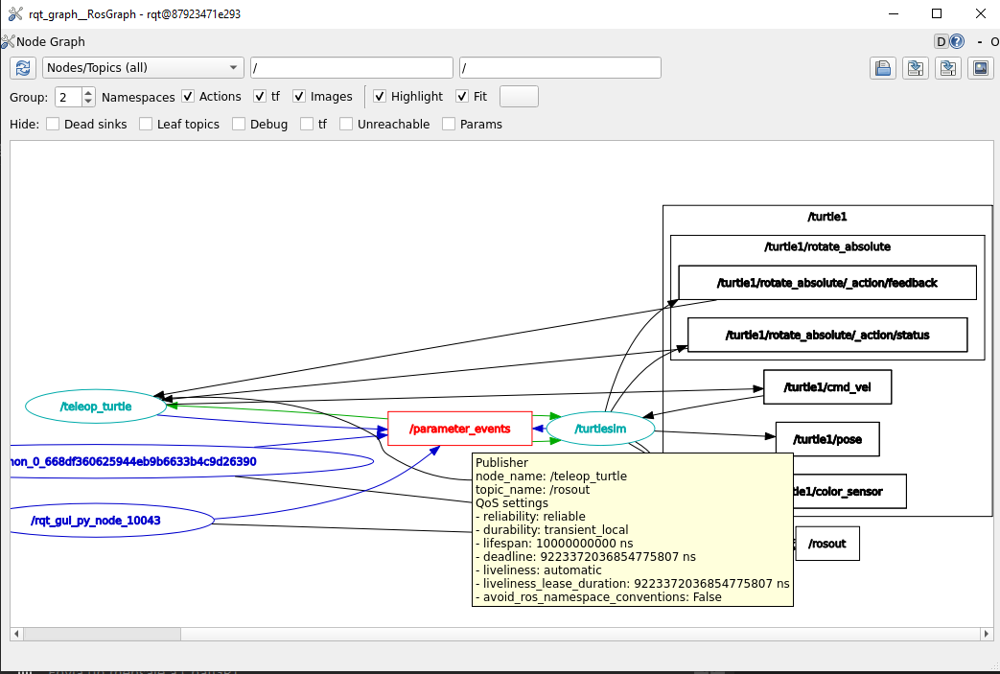

Parameters
=====

.. _parameters:

What is a parameter?
----------------

- Parameters can be thought as node settings. These parameters can be set at runtime and can be changed without restarting the node.
- A node can store parameters as integers, floats, booleans, strings, and lists. 
- In ROS 2, each node maintains its own parameters. 
- Parameters can also be used to configure the behavior of the ROS 2 middleware itself, such as setting the logging level, defining QoS (Quality of Service) settings, etc.
- Parameters are often specified in launch files, which are XML files used to start multiple ROS 2 nodes and set their parameters in a coordinated way.

Do not forget 
-------------
Remember to have your environment properly setup. Perform the following, if a ROS 2 package cannot be found when executing it:

.. code-block:: console

   source install/setup.sh

See this example: 

- Look at the error of not being able to find a desired package. This is because the workspace was not configured correctly.

.. image:: images/errorNotSourcing.png
   :alt: Error message of not sourcing workspace correctly.

- Source the appropriate setup script to correctly configure the environment.

.. image:: images/sourcingWorkspace.png
   :alt: Correctly sourcing the workspace.

Notice that the sourcing is performed inside the workspace folder. More information on sourcing the environment, `check it here`_.

.. _check it here: https://ros2course.readthedocs.io/en/latest/Configuring%20environment.html#workspace-sourcing

Important commands. Parameters 
--------------------------

Make sure to be in a `brand new terminal`_ window and no ROS command is currently running. 

.. _`brand new terminal`: https://ros2course.readthedocs.io/en/latest/Installation%20and%20software%20setup.html#running-a-docker-container

The following can be performed when working with parameters.

1. Listing all parameters
~~~~~~~~~~~~~~~~~~~~~

Let's first run these two nodes in separate terminal windows.

.. code-block:: console

   ros2 run turtlesim turtlesim_node

   ros2 run turtlesim turtle_teleop_key

`Open a new terminal`_ and execute:

.. _open a new terminal: https://ros2course.readthedocs.io/en/latest/Installation%20and%20software%20setup.html#opening-a-new-terminal-for-the-docker-container

.. code-block:: console

   ros2 param list

A list of all available parameters will be displayed. 

.. code-block:: console

   /teleop_turtle:
      qos_overrides./parameter_events.publisher.depth
      qos_overrides./parameter_events.publisher.durability
      qos_overrides./parameter_events.publisher.history
      qos_overrides./parameter_events.publisher.reliability
      scale_angular
      scale_linear
      use_sim_time
   /turtlesim:
      background_b
      background_g
      background_r
      qos_overrides./parameter_events.publisher.depth
      qos_overrides./parameter_events.publisher.durability
      qos_overrides./parameter_events.publisher.history
      qos_overrides./parameter_events.publisher.reliability
      use_sim_time  

From the above result, ``/teleop_turtle`` and ``/turtlesim`` are two namespaces that correspond to the two nodes that were executed.

There is a group of parameters that are repeated for each namespace:

.. code-block:: console

   qos_overrides./parameter_events.publisher.depth
   qos_overrides./parameter_events.publisher.durability
   qos_overrides./parameter_events.publisher.history
   qos_overrides./parameter_events.publisher.reliability

All these parameters are related to Quality of Service (QoS) settings for the publisher that is responsible of publishing parameter change events. When parameters are changed, parameter events are generated. These events are typically published on a special topic so that other parts of the system can be aware of parameter changes.

Each of these parameters particularly specify:

- ``qos_overrides./parameter_events.publisher.depth``: This parameter defines the maximum number of messages that can be queued for the publisher of parameters change. It specifies the depth of the publisher's message queue. If the queue is full and new messages arrive, older messages will be dropped. 
- ``qos_overrides./parameter_events.publisher.durability``: Durability defines whether published messages should be retained even if there are no subscribers at the moment. Durability settings include ``volatile`` (messages are not retained), ``transient_local`` (messages are retained as long as there is at least one local subscriber), and ``transient`` (messages are retained as long as there is at least one subscriber).
- ``qos_overrides./parameter_events.publisher.history``: This parameter specifies the kind of history policy used. History policies include ``keep_last`` (only the last N messages are retained), ``keep_all`` (all messages are retained), and ``unknown`` (the history policy is unknown or unspecified).
- ``qos_overrides./parameter_events.publisher.reliability``: Reliability defines whether published messages should be delivered reliably to subscribers. Reliability settings include ``reliable`` (messages are delivered reliably, with acknowledgments), and ``best_effort`` (messages are sent without acknowledgments, which may result in message loss).

And the other parameters that are specific to a namespace refer to:

.. code-block:: console

   /teleop_turtle:
      ...
      scale_angular
      scale_linear
      use_sim_time
   /turtlesim:
      background_b
      background_g
      background_r
      ...
      use_sim_time  

For the ``/teleop_turtle`` namespace:

- ``scale_angular``: Controls the scaling factor for angular velocity commands sent to control the turtle's rotational motion.
- ``scale_linear``: Controls the scaling factor for linear velocity commands sent to control the turtle's forward/backward motion.
- ``use_sim_time``: This is a common ROS parameter used across various nodes. When set to true, it indicates that the node should use simulated time instead of wall-clock time. This is useful when running simulations where time should progress according to the simulation environment rather than real-world time.

For the ``/turtlesim`` namespace:

- ``background_b``, ``background_g``, ``background_r``: Define the RGB values for the background color of the turtle simulation environment.

2. ros2 param get
~~~~~~~~~~~~~~~~~~~~~

The command structure to get the type and current value of a parameter is: 

.. code-block:: console

   ros2 param get <node_name> <parameter_name>

Check an example and run the command below: 

.. code-block:: console

   ros2 param get /turtlesim background_g

The expected result is: 

.. code-block:: console

   Integer value is: 86

From this, it can be concluded that the type of the ``background_g`` parameter is an int type variable.

3. ros2 param set
~~~~~~~~~~~~~~~~~~~~~~~~~~~~~~~~~~~~

This is the structure of the command to change a parameter's value at runtime: 

.. code-block:: console

   ros2 param set <node_name> <parameter_name> <value>

As an example, run the code below: 

.. code-block:: console

   ros2 param set /turtlesim background_r 150

The expected result is: 

.. code-block:: console

   Set parameter successful

And looking at the turtlesim window, its background color has changed to purple.
Setting parameters with the ``set`` command will only change them in the current session, not permanently.   

4. ros2 param dump
~~~~~~~~~~~~~~~~~~~~~~~

Either of these commands structures are capable to display all of a node's current parameter values:

.. code-block:: console

   ros2 param dump <node_name>
   ros2 param dump <node_name> > <file_name.yaml>

The first one will print in the terminal window, the parameters with their correspondant values; while the second command structure will redirect the parameter values into a file to save them for later.

Run the example below:

.. code-block:: console

   ros2 param dump /turtlesim

The output in the terminal will be:

.. code-block:: console

   /turtlesim:
   ros__parameters:
    background_b: 255
    background_g: 86
    background_r: 150
    qos_overrides:
      /parameter_events:
        publisher:
          depth: 1000
          durability: volatile
          history: keep_last
          reliability: reliable
    use_sim_time: false

Check this other example:

.. code-block:: console

   ros2 param dump /turtlesim > turtlesim.yaml

As a result, a new .yaml file will be created in the current directory. 

Of course, the content of this file will be the same as the terminal output that was seen before.

5. ros2 param load
~~~~~~~~~~~~~~~~~~~~~~~~~~

To load parameters from a file to a currently running node, the following command structure should be executed:

.. code-block:: console

   ros2 param load <node_name> <parameter_file>

Run this example:

.. code-block:: console

   ros2 param load /turtlesim turtlesim.yaml

As a result, the following should be displayed in the terminal.

.. code-block:: console

   Set parameter background_b successful
   Set parameter background_g successful
   Set parameter background_r successful
   Set parameter qos_overrides./parameter_events.publisher.depth failed: parameter 'qos_overrides./parameter_events.publisher.depth' cannot be set because it is read-only
   Set parameter qos_overrides./parameter_events.publisher.durability failed: parameter 'qos_overrides./parameter_events.publisher.durability' cannot be set because it is read-only
   Set parameter qos_overrides./parameter_events.publisher.history failed: parameter 'qos_overrides./parameter_events.publisher.history' cannot be set because it is read-only
   Set parameter qos_overrides./parameter_events.publisher.reliability failed: parameter 'qos_overrides./parameter_events.publisher.reliability' cannot be set because it is read-only
   Set parameter use_sim_time successful

The warnings that are displayed are pretty self-explanatory. These are read-only parameters and can only be modified at startup.

6. Load parameter file on node startup
~~~~~~~~~~~~~~~~~~~~~~~~~~~~~~~~

To start a node using saved parameter values, the following command structure should be executed:

.. code-block:: console

   ros2 run <package_name> <executable_name> --ros-args --params-file <file_name>

Make sure to be in a `brand new terminal`_ and no ROS commands are currently running. 

Run this command:

.. code-block:: console

   ros2 run turtlesim turtlesim_node --ros-args --params-file turtlesim.yaml

The turtlesim window should appear as usual, but with the purple background. Additionally, when a parameter file is used at node startup, all parameters, including the read-only ones, will be updated.
