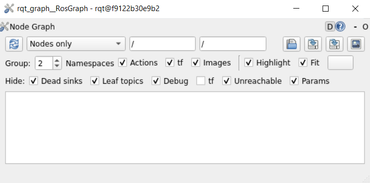
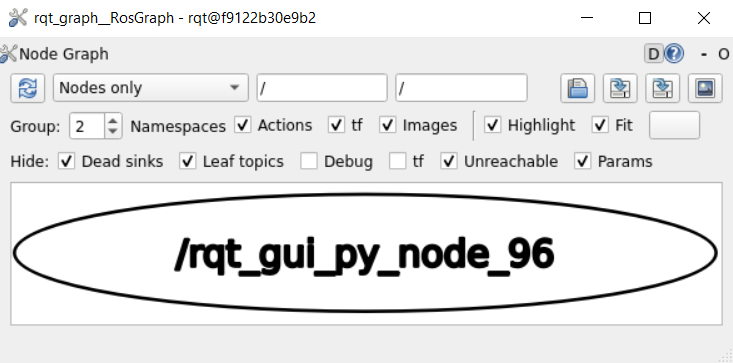
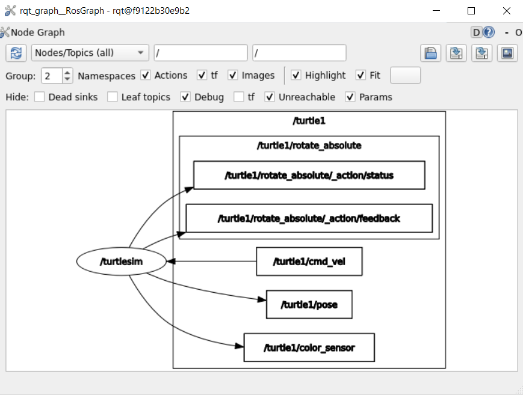
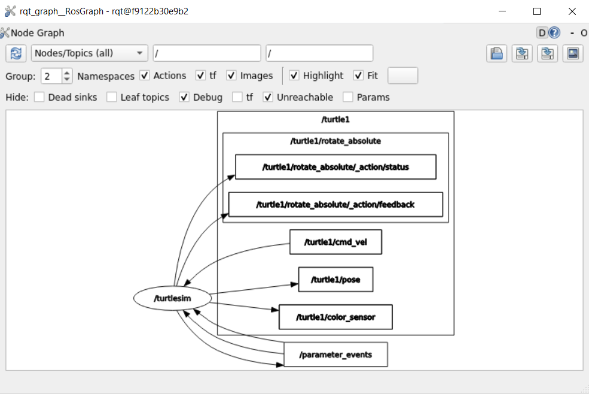

ROS 2 utilites
=====

.. _ros2_utils:

The following section is devoted to show and describe the basic functionality of some important ROS 2 utilities. These are:

ROS 2 bag
------------

- This is a command-line tool in ROS 2 used for recording and playing back data from ROS 2 topics.
- It accumulates the data passed on any number of topics and saves it in a database.
- The data can then be replayed to reproduce the results of tests and experiments.

ROS 2 bag record
~~~~~~~~~~~~~

Having previously initiated a Docker container, start by launching the ``turtlesim_node`` along with the ``turtle_teleop_key``. `Open two terminals`_ and execute in each of them:

.. _Open two terminals: https://ros2course.readthedocs.io/en/latest/Installation%20and%20software%20setup.html#opening-a-new-terminal-for-the-docker-container

.. code-block:: console

   ros2 run turtlesim turtlesim_node

   ros2 run turtlesim turtle_teleop_key

In a new terminal create a new folder to store the ROS 2 bag file inside ``ros2_ws`` workspace, and get into that folder. For this, run:

.. code-block:: console

   mkdir bag_files
   cd bag_files

Now, to record the data published to a specific topic use this command syntax:

.. code-block:: console

   ros2 bag record <topic_name>

Run this example:

.. code-block:: console

   ros2 bag record /turtle1/cmd_vel

The following will be displayed in the terminal:

.. code-block:: console

   [INFO] [1712867867.590658178] [rosbag2_recorder]: Press SPACE for pausing/resuming
   [INFO] [1712867867.621929975] [rosbag2_storage]: Opened database 'rosbag2_2024_04_11-20_37_47/rosbag2_2024_04_11-20_37_47_0.db3' for READ_WRITE.
   [INFO] [1712867867.624862506] [rosbag2_recorder]: Listening for topics...
   [INFO] [1712867867.624890008] [rosbag2_recorder]: Event publisher thread: Starting
   [INFO] [1712867867.629127497] [rosbag2_recorder]: Subscribed to topic '/turtle1/cmd_vel'
   [INFO] [1712867867.629331906] [rosbag2_recorder]: Recording...
   [INFO] [1712867867.629486213] [rosbag2_recorder]: All requested topics are subscribed. Stopping discovery...

Now ROS 2 bag is recording the data published on the ``/turtle1/cmd_vel`` topic. Return to the ``turtle_teleop_key`` terminal and move the turtle around again. 

Now, stop the recording (pressing Ctrl+C) and see that a new ``.yaml`` file was created. ``ls`` into the ``ros2_ws/bag_files`` folder and some file like this should be generated:

.. code-block:: console

   rosbag2_2024_04_11-20_37_47

ROS 2 bag info
~~~~~~~~~~~~~

To see details about the recording, run a command following this structre:

.. code-block:: console

   ros2 bag info <bag_file_name>

Apply this command into the recently generated ROS 2 bag file:

.. code-block:: console

   ros2 bag info rosbag2_2024_04_11-20_37_47

Somthing like the following should be the otuput of this:

.. code-block:: console

   Files:             subset.db3
   Bag size:          228.5 KiB
   Storage id:        sqlite3
   Duration:          48.47s
   Start:             Oct 11 2019 06:09:09.12 (1570799349.12)
   End                Oct 11 2019 06:09:57.60 (1570799397.60)
   Messages:          3013
   Topic information: Topic: /turtle1/cmd_vel | Type: geometry_msgs/msg/Twist | Count: 9 | Serialization Format: cdr
                  Topic: /turtle1/pose | Type: turtlesim/msg/Pose | Count: 3004 | Serialization Format: cdr
   
ROS 2 bag play
~~~~~~~~~~~~~

To replay the recorded ROS 2 bag file, first stop the execution of ``turtlesim_node`` and ``turtle_teleop_key`` nodes and follow this command structre:

.. code-block:: console

   ros2 bag play <bag_file_name>

Apply this command into the generated ROS 2 bag file, but first exeucte again the ``turtlesim_node``:

.. code-block:: console

   ros2 bag play rosbag2_2024_04_11-20_37_47

The turtle will follow the same path that was recorded before (though not 100% exactly; turtlesim is sensitive to small changes in the system's timing).

ROS 2 rqt_graph
------------

- This is a command-line tool in ROS 2 used for checking the flow of information amongst the available nodes, topics and parameters within a particular the ROS 2 application.
- It graphically displays the ROS 2 entities exchanging information among them. 
- Throught the GUI that is provided, certain options can be enabled/disabled to analyze the elements of interest.

Running rqt_graph
~~~~~~~~~~~~~~~~~

Since this command-line tool will make use of a GUI window, it is necessary to initiate a Docker container with ``Xlaunch``. Recall `this part of the course`_ and start a Docker container as such.  

.. _this part of the course: https://ros2course.readthedocs.io/en/latest/Installation%20and%20software%20setup.html#running-a-docker-container

Start by executing the command-line tool:

.. code-block:: console

   rqt_graph

As a result an empty rqt_graph window will open.

At this point, no node is being executed, that is why the rqt_graph window is empty. 

Notice as well, the ``Hide`` section of the GUI, and see that almost all of the options are checked. Uncheck the ``Debug`` option and see the result.

It displays one node that is currently available, that is, the ``rqt_graph`` execution itself. `Open a new terminal`_ and execute:

.. _Open a new terminal: https://ros2course.readthedocs.io/en/latest/Installation%20and%20software%20setup.html#opening-a-new-terminal-for-the-docker-container

.. code-block:: console

   ros2 node list

The result will be a list of only one node, this is the very same node that is displayed in the rqt graph. 

Analyzing the elements of the rqt graph
~~~~~~~~~~~~~~~~~~~~~~~~~~~~~~~~~~~~~~~~

Now, see what happens in the rqt graph when executing the ``turtlesim_node`` example. In the terminal where ``ros2 node list`` was executed, type:

.. code-block:: console

   ros2 run turtlesim turtlesim_node
 
This will launch the turtlesim_node example opening a turtlesim window. Go to the rqt graph window and click on the ``Refresh`` button, this will display three different nodes; but for the moment the ``Debug`` option from the ``Hide`` section is not relevant, check that option.

At this point, only the ``/turtlesim`` node is displayed in the rqt graph. See the result when selecting the ``Nodes/Topics(all)`` option and unchecking the options: ``Dead sinks`` and ``Leaf topics``.

The above result describes the node information contained in the ``/turtlesim`` node. `Open a new terminal`_ and execute:

.. code-block:: console

   ros2 node info /turtlesim

Which will otuput the folowing:

.. code-block:: console

   /turtlesim
   Subscribers:
      /parameter_events: rcl_interfaces/msg/ParameterEvent
      /turtle1/cmd_vel: geometry_msgs/msg/Twist
   Publishers:
      /parameter_events: rcl_interfaces/msg/ParameterEvent
      /rosout: rcl_interfaces/msg/Log
      /turtle1/color_sensor: turtlesim/msg/Color
      /turtle1/pose: turtlesim/msg/Pose
   Service Servers:
      /clear: std_srvs/srv/Empty
      /kill: turtlesim/srv/Kill
      /reset: std_srvs/srv/Empty
      /spawn: turtlesim/srv/Spawn
      /turtle1/set_pen: turtlesim/srv/SetPen
      /turtle1/teleport_absolute: turtlesim/srv/TeleportAbsolute
      /turtle1/teleport_relative: turtlesim/srv/TeleportRelative
      /turtlesim/describe_parameters: rcl_interfaces/srv/DescribeParameters
      /turtlesim/get_parameter_types: rcl_interfaces/srv/GetParameterTypes
      /turtlesim/get_parameters: rcl_interfaces/srv/GetParameters
      /turtlesim/list_parameters: rcl_interfaces/srv/ListParameters
      /turtlesim/set_parameters: rcl_interfaces/srv/SetParameters
      /turtlesim/set_parameters_atomically: rcl_interfaces/srv/SetParametersAtomically
   Service Clients:

   Action Servers:
      /turtle1/rotate_absolute: turtlesim/action/RotateAbsolute
   Action Clients:

See that the output corresponds to the rqt graph. Meaning that the ``/turtlesim`` node is indeed publishing to ``/turtle1/color_sensor`` and ``/turtle1/pose`` from the ``Publishers`` section, and also sends data to the ``/turtle1/rotate_absolute`` action server.
On the other hand, the ``/turtlesim`` node is subscribed to the ``/turtle1/cmd_vel`` topic.

Now, see the result when unchecking the ``Params`` option from the ``Hide`` section in the rqt graph. 

See that the corresponding ``/parameter_events`` topic is now displayed, and it indicates that the ``/turtlesim`` node publishes and subscribes to it. 

In general, ``rqt_graph`` provides a visualization that can be incredibly helpful for understanding the structure and communication patterns within a ROS-based robotics system. It can be useful for debugging, identifying potential issues, and gaining insights into the overall behavior of the ROS 2 application.

 

