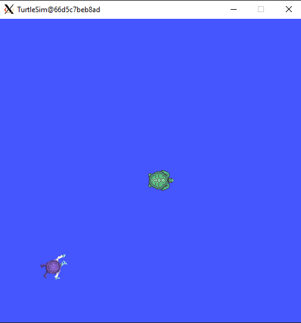

Services
=====

.. _services:

What is it?
------------

- A way for nodes to communicate with each other by sending a request and receiving a response. 
- Provides a synchronous communication pattern where a client node requests a service from a server node and waits for a response. The client typically waits for a response from the server before proceeding with other tasks
- Services follow a client-server model. The node that requests a service is the client, and the node that provides the service is the server
- A service call consists of a request message sent from the client to the server, and a response message sent back from the server to the client.
- ROS 2 provides built-in mechanisms for ensuring the robustness and reliability of service calls, including error handling, timeouts, and quality-of-service (QoS) settings.

Key differences betweeen services and topics:

.. list-table:: Services vs Topics
   :widths: 50 50
   :header-rows: 1

   * - Topics
     - Services
   * - Should be used for continuous data streams (sensor data,  robot state, …) 
     - Should be used for remote procedure calls that terminate quickly, e.g. for querying the state of a node or doing a quick calculation such as IK. 
   * - Are for continuous data flow. Many-to-many connections.
     - They should never be used for longer running processes, in particular processes that might be required to preempt if exceptional situations occur and they should never change or depend on state to avoid unwanted side effects for other nodes.
   * - Data might be published and subscribed at any time independent of any senders/receivers. 
     - Mostly used for comparably fast tasks as requesting specific data.
   * - Callbacks receive data once it is available. 
     - Simple calling block.        
   * - The publisher decides when data is sent.      
     - Semantically for processing requests.

.. image:: https://docs.ros.org/en/humble/_images/Service-SingleServiceClient.gif
   :alt: The way nodes communicate through services.

.. image:: https://docs.ros.org/en/humble/_images/Service-MultipleServiceClient.gif
   :alt: Multiple service clients but only one server.

Do not forget 
-------------
Remember to have your environment properly setup. Perform the following, if the ROS 2 package cannot be found when executing it:

.. code-block:: console

   source install/setup.sh

See this example: 

- Look at the error of not being able to find the desired package. This is because the workspace was not configured correctly.

.. image:: images/errorNotSourcing.png
   :alt: Error message of not sourcing workspace correctly.

- Source the appropriate setup script, that is, run ``source install/setup.sh``, to correctly configure the environment.

.. image:: images/sourcingWorkspace.png
   :alt: Correctly sourcing the workspace.

Notice that the sourcing is performed inside the workspace folder. More information on sourcing the environment, `check it here`_.

.. _check it here: https://ros2course.readthedocs.io/en/latest/Configuring%20environment.html#workspace-sourcing

Important commands. Services
-------------------------
Make sure to be in a `brand new terminal`_ window and no ROS command is currently running. 

.. _`brand new terminal`: https://ros2course.readthedocs.io/en/latest/Installation%20and%20software%20setup.html#running-a-docker-container

Execute this node:

.. code-block:: console

   ros2 run turtlesim turtlesim_node

`Open a new terminal`_ and execute:

.. _open a new terminal: https://ros2course.readthedocs.io/en/latest/Installation%20and%20software%20setup.html#opening-a-new-terminal-for-the-docker-container

.. code-block:: console

   ros2 run turtlesim turtle_teleop_key

1. Listing all services
~~~~~~~~~~~~~~~~~

`Open a new terminal`_ and execute:

.. code-block:: console

   ros2 service list

This will list all the services that are available.

.. code-block:: console

   /clear
   /kill
   /reset
   /spawn
   /teleop_turtle/describe_parameters
   /teleop_turtle/get_parameter_types
   /teleop_turtle/get_parameters
   /teleop_turtle/list_parameters
   /teleop_turtle/set_parameters
   /teleop_turtle/set_parameters_atomically
   /turtle1/set_pen
   /turtle1/teleport_absolute
   /turtle1/teleport_relative
   /turtlesim/describe_parameters
   /turtlesim/get_parameter_types
   /turtlesim/get_parameters
   /turtlesim/list_parameters
   /turtlesim/set_parameters
   /turtlesim/set_parameters_atomically

Notice that the executed nodes have the same six services: ``/describe_parameters``, ``/get_parameter_types``, ``/get_parameters``, ``/list_parameters``, ``/set_parameters`` and ``/set_parameters_atomically``. Nearly every node in ROS 2 has these infrastructure services that parameters are built off of; these services have to do with ROS 2 parameters. 

For the moment, on these services: ``/clear``, ``/kill``, ``/reset``, ``/spawn``, ``/turtle1/set_pen``, ``/turtle1/teleport_absolute``, and ``/turtle1/teleport_relative``.

2. Service type
~~~~~~~~~~~~~~~~~

Services types have two parts: one message for the request and another for the response. This is the structure of the command to see the type of a service:

.. code-block:: console

   ros2 service type <service_name>

`Open a new terminal`_ and try this example:

.. code-block:: console

   ros2 service type /clear

Which should return:

.. code-block:: console

   std_srvs/srv/Empty

Meaning that this service sends no data when making a request and receives no data when receiving a response.

3. Finding services
~~~~~~~~~~~~~~~~~~~~~

If looking for all the services of a given type, this is the command structure that should be followed:

.. code-block:: console

   ros2 service find <type_name>

Try this example:

.. code-block:: console

   ros2 service find std_srvs/srv/Empty

The output should be:

.. code-block:: console

   /clear
   /reset

Meaning that these two services send no data when making the request or when receiving the response.

4. Getting info from a service type
~~~~~~~~~~~~~~~~~~~~~

This is the structure of the command to get the information of a service type:

.. code-block:: console

   ros2 interface show <type_name>

Try this example:

.. code-block:: console

   ros2 interface show std_srvs/srv/Empty

Which will return:

.. code-block:: console

   ---

Now, try this other example:

.. code-block:: console

   ros2 interface show turtlesim/srv/Spawn

With output:

.. code-block:: console

   float32 x
   float32 y
   float32 theta
   string name # Optional.  A unique name will be created and returned if this is empty
   ---
   string name

The information above the ``---`` line specifies the arguments needed to call ``/spawn`` service. ``x``, ``y`` and ``theta`` determine the 2D pose of the spawned turtle. ``name`` is clearly optional.

The information below the ``---`` line correspond to the data type of the response one gets from calling ``/spawn`` service.

5. Calling a service
~~~~~~~~~~~~~~~~~~~~~

In order to call a service, the following structure is to be issued:

.. code-block:: console

   ros2 service call <service_name> <service_type> <arguments>

The ``<arguments>`` part is optional. 

With having previously ran the turtlesim node, check this example:

.. code-block:: console

   ros2 service call /spawn turtlesim/srv/Spawn "{x: 2, y: 2, theta: 0.2, name: 'Juan'}"

The turtlesim window should be updated to display a new turtle like the following:

And the terminal window should output:

.. code-block:: console

   requester: making request: turtlesim.srv.Spawn_Request(x=2.0, y=2.0, theta=0.2, name='Juan')

   response:
   turtlesim.srv.Spawn_Response(name='Juan')

