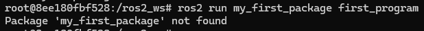

Topics
=====

.. _topics:

What is a topic?
----------------

- It is a communication channel over which nodes can exchange messages. 
- Topics use a publish-subscribe model. Nodes can publish messages to a topic or subscribe to receive messages from a topic. This allows for asynchronous and decoupled communication between nodes.
- Each topic is identified by a unique name. Typically named to reflect the type of data being exchanged, such as /sensor_data, /robot_pose, or /image.
- Topics have associated message types that define the structure of the data being exchanged.
- Messages published to a topic are distributed to all nodes that are subscribed to that topic. 

.. image:: https://docs.ros.org/en/humble/_images/Topic-MultiplePublisherandMultipleSubscriber.gif
   :alt: Topics and the way they work.

Do not forget 
-------------
Remember to have the ROS 2 environment properly setup. Perform the following, if the ROS2 package cannot be found when executing it:

.. code-block:: console

   source install/setup.sh

See this example: 

- Look at the error of not being able to find the desired package. This is because the workspace was not configured correctly.

- Source the appropriate setup script to correctly configure the environment.

.. image:: images/sourcingWorkspace.png
   :alt: Correctly sourcing the workspace.

Notice that the sourcing is performed inside the workspace folder. More information on sourcing the environment, `check it here`_.

.. _check it here: https://ros2course.readthedocs.io/en/latest/Configuring%20environment.html#workspace-sourcing

Important commands. Topics 
--------------------------

Make sure to be in a `brand new terminal`_ window and no ROS command is currently running. 

.. _`brand new terminal`: https://ros2course.readthedocs.io/en/latest/Installation%20and%20software%20setup.html#running-a-docker-container

The following can be performed when working with topics.

1. Listing all topics
~~~~~~~~~~~~~~~~~~~~~

To list all available topics, execute:

.. code-block:: console

   ros2 topic list

Two topics will we be displayed as a result. 

.. code-block:: console

   /parameter_events
   /rosout  

The topic ``/parameter_events`` is a global topic which is always present in the ROS 2 network. The nodes use the ``/paramater_events`` topic to monitor or change parameters in the network. While the ``/rosout`` topic is used for logging messages in the ROS 2 system.

As an example, `open two new terminals`_ and execute respectively these two commands:

.. _open two new terminals: https://ros2course.readthedocs.io/en/latest/Installation%20and%20software%20setup.html#opening-a-new-terminal-for-the-docker-container

.. code-block:: console

   ros2 run turtlesim turtlesim_node 
   ros2 run turtlesim turtle_teleop_key

Afterwards, return to the terminal where it was ran ``ros2 topic list`` and run it again. The following will be listed:

.. code-block:: console

   /parameter_events
   /rosout
   /turtle1/cmd_vel
   /turtle1/color_sensor
   /turtle1/pose

Check as well the rqt graph, run: 

.. code-block:: console

   rqt_graph

See a simplified version of the topics and nodes.

And if all the "hide" options are unchecked, it can be seeen all the topics listed above.

2. Getting info from a topic
~~~~~~~~~~~~~~~~~~~~~~~~~~~~

The command structure to get the information of a topic, is: 

.. code-block:: console

   ros2 topic info <topic_name> 

Check the example and run the command below: 

.. code-block:: console

   ros2 topic info /turtle1/cmd_vel

The expected result is: 

.. code-block:: console

   Type: geometry_msgs/msg/Twist
   Publisher count: 1
   Subscription count: 1

The information included in the topic consists on:

- The type of messages that the topic is handling.
- A count of how many nodes are publishing to the given topic. 
- A count of how many nodes are subscribed to the given topic.

3. Getting info from a topic message
~~~~~~~~~~~~~~~~~~~~~~~~~~~~~~~~~~~~

A topic message refers to the data structure used for communication between nodes over a topic. Messages define the format and content of the data being exchanged between nodes. This is the structure of the command to get the information of a topic message: 

.. code-block:: console

   ros2 interface show <message_name>

As an example, run the code below: 

.. code-block:: console

   ros2 interface show geometry_msgs/msg/Twist

The expected result is: 

.. code-block:: txt

   # This expresses velocity in free space broken into its linear and angular parts.
   Vector3  linear
         float64 x
         float64 y
         float64 z
   Vector3  angular
         float64 x
         float64 y
         float64 z

This indicates that the structure of messages that the ``/turtle1/cmd_vel`` topic handles, is one which involves two vectors: ``linear`` and  ``angular`` which at the same time, each one of them, includes three float64 variables. This provides insights of how the nodes are working among them and which type of data one node expects from the other. 

4. Echoing a given topic
~~~~~~~~~~~~~~~~~~~~~~~

From the terminal window, it is possible to listen to messages that reach a given topic. This is the structure of the command that is capable to perform such a task:

.. code-block:: console

   ros2 topic echo <topic_name>

Run the example below:

.. code-block:: console

   ros2 topic echo /turtle1/cmd_vel

Nothing will be displayed in the terminal because no messages are being sent to the given topic. However, when going back to the terminal where ``turtle_teleop_key`` was executed and the forward arrow key (↑) is pressed, the following will be displayed:

.. code-block:: console

   linear:
      x: 2.0
      y: 0.0
      z: 0.0
   angular:
      x: 0.0
      y: 0.0
      z: 0.0
   ---

As it can be seen, this topic handles velocity data. Depending on which arrow key is pressed, the linear or angular velocity data will be modified.

Finally, by looking at the rqt graph and unchecking the "Debug" option, the following is displayed.

Notice that a new node named ``/_ros2cli_618`` is visible and it is subscribed to the ``/turtle1/cmd_vel`` topic. This corresponds to the command: ``ros2 topic echo /turtle1/cmd_vel``.

5. Publishing into a topic
~~~~~~~~~~~~~~~~~~~~~~~~~~

To publish messages to a given topic, the following command structure should be executed:

.. code-block:: console

   ros2 topic pub <topic_name> <msg_type> '<args>'

It is specified the topic name which it is desired to pusblish to, the type of message and the message itself. 
To see an example of the publishing, end all previous nodes (Ctrl+C in each terminal window) and execute the turtlesim node (``ros2 run turtlesim turtlesim_node``). `Open a new terminal`_ and execute the following:

.. code-block:: console

   ros2 topic pub --once /turtle1/cmd_vel geometry_msgs/msg/Twist "{linear: {x: 2.0, y: 0.0, z: 0.0}, angular: {x: 0.0, y: 0.0, z: 1.8}}"

As a result, the turtle animation should move a quarter portion of a cirle and the following should be displayed in the terminal.

.. code-block:: console

   publisher: beginning loop
   publishing #1: geometry_msgs.msg.Twist(linear=geometry_msgs.msg.Vector3(x=2.0, y=0.0, z=0.0), angular=geometry_msgs.msg.Vector3(x=0.0, y=0.0, z=1.8))

In the above-command the ``--once`` part is an optional argument, meaning that the message will be published only once. If the execution changes to be the following one, then the turtle animation would keep on moving in circles.

.. code-block:: console

   ros2 topic pub --rate 1 /turtle1/cmd_vel geometry_msgs/msg/Twist "{linear: {x: 2.0, y: 0.0, z: 0.0}, angular: {x: 0.0, y: 0.0, z: 1.8}}"

It has been replaced ``--once`` by ``--rate 1`` to indicate that the message should be published at 1 hz rate. It should also be displayed in the terminal where the command was executed, the following messages:

.. code-block:: console

   publisher: beginning loop
   publishing #1: geometry_msgs.msg.Twist(linear=geometry_msgs.msg.Vector3(x=2.0, y=0.0, z=0.0), angular=geometry_msgs.msg.Vector3(x=0.0, y=0.0, z=1.8))
   publishing #2: geometry_msgs.msg.Twist(linear=geometry_msgs.msg.Vector3(x=2.0, y=0.0, z=0.0), angular=geometry_msgs.msg.Vector3(x=0.0, y=0.0, z=1.8))
   publishing #3: geometry_msgs.msg.Twist(linear=geometry_msgs.msg.Vector3(x=2.0, y=0.0, z=0.0), angular=geometry_msgs.msg.Vector3(x=0.0, y=0.0, z=1.8))
   ...

The publishing of the message can be stopped by pressing Ctrl+C. Additionally, running ``rqt_graph`` in a new terminal, should display something similar to this:

As in the echoing example, a new node is created (``/_ros2cli_960``) and it is publishing to the ``/turtle1/cmd_vel`` topic.

6. Checking a topic working rate
~~~~~~~~~~~~~~~~~~~~~~~~~~~~~~~~

To see the rate at which a topic is handling the messages, the following command structure should be executed:

.. code-block:: console

   ros2 topic hz <topic_name>

`Open a new terminal`_ and execute the following:

.. _open a new terminal: https://ros2course.readthedocs.io/en/latest/Installation%20and%20software%20setup.html#opening-a-new-terminal-for-the-docker-container

.. code-block:: console

   ros2 topic hz /turtle1/cmd_vel

It displays the average rate at which messages are being handled in the given topic. The expected results are these messages displayed in the terminal window.

.. code-block:: console
   
   average rate: 1.000
         min: 0.998s max: 1.002s std dev: 0.00044s window: 247
   average rate: 1.000
         min: 0.998s max: 1.002s std dev: 0.00044s window: 248
   average rate: 1.000
         min: 0.998s max: 1.002s std dev: 0.00044s window: 250
   ...

Chek that the average rate is at 1.00, which is expected, since the publishing rate that was issued before, was exactly 1.0. It was indicated in this part of the command execution: ``ros2 topic pub --rate 1 ...``.

