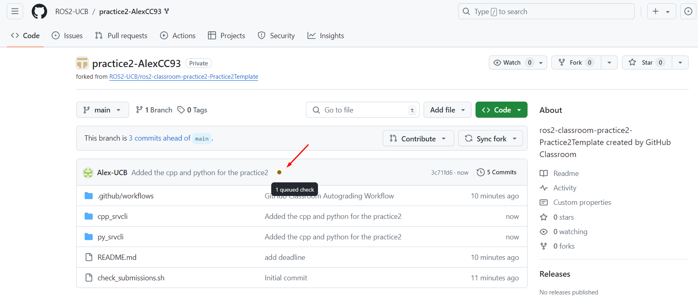

Uploading practices
=====

.. _uploading practices:

Each student of the course should have his/her own remote repository configured in Github. In order to centralize the deliverables of all students in one site, the Github classroom tool is used. 

First, each student should enter the links provided below according to the practice he/she wants to upload to.

- For practice 1: https://classroom.github.com/a/ff9a3SPA
- For practice 2: https://classroom.github.com/a/YW9AHJSs
- For practice 3: https://classroom.github.com/a/yly1SDoH

When a student clicks on one of the links above, an invitation to work in the correspondant repository will be presented. Accept that invitation. 

When accepting the assignment it should look like shown below

See that the repository is forked from: ``ROS2-UCB/ros2-classroom-practice2-Practice2Template`` and belongs to the ``ROS2-UCB`` organization. This is not a repository that belongs to each student but corresponds to each of them; this is where a student will upload the correspndant practice code.

This forked repository should be cloned to each of the student's local machine and upload to it the python and cpp version of the correspondant practice. See the example below.

.. code-block:: console

   git clone <linkOfTheForkedRepo>

   git clone https://github.com/ROS2-UCB/practice2-AlexCC93.git

By looking at the example above, make sure that the name of the packages being uploaded are the same as the ones indicated in the tutorial of the correspondant practice. For example, for the above shown practice 2, the names of the packages that were worked on, were ``cpp_srvcli`` and ``py_srvcli``, for C++ and python respectively, and the code for completing the python and cpp versions of the practice should reside in these very same packages. 

Review, add, commit and push the changes. 

.. code-block:: console

   git add .

   git commit -m "Added python and cpp versions of the practice 2"

   git push

Go to the browser, refresh and see the status of the forked repository. See that an automated autograder is running and checking the submission. 

After this is complete, if everything went right, the status of the repository should look like this.
 

One can go further and check details of the autograder. 

If not all the files were correctly uploaded or the names of the packages do not match what had been indicated, this autograder will fail its execution, and a new corrected push should be performed.

Do the same for all practices and final project. 

IMPORTANT
------------

Do notice as well that the due date for practices 1 and 2 are until **Thursday, august the 1st.**.

