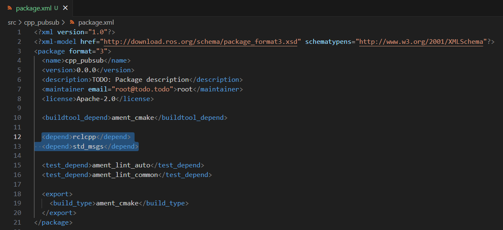
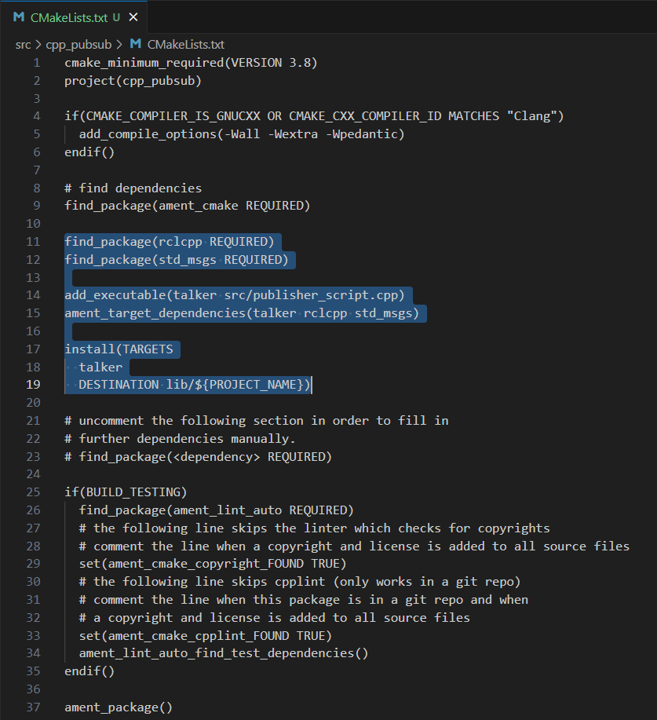
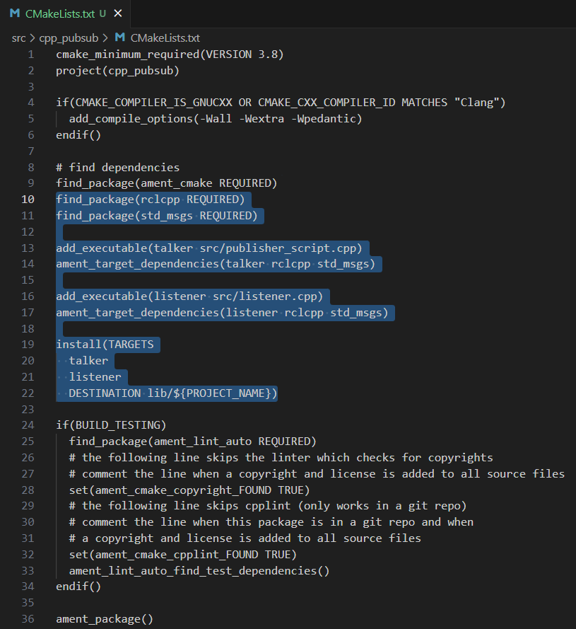
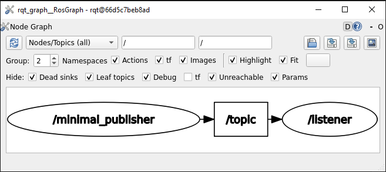
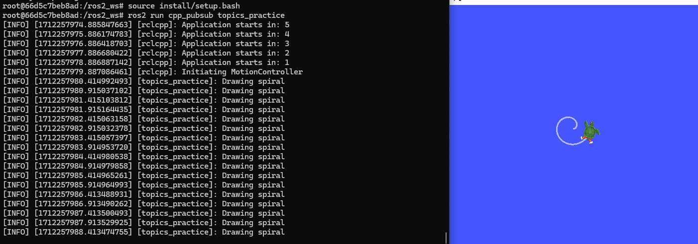
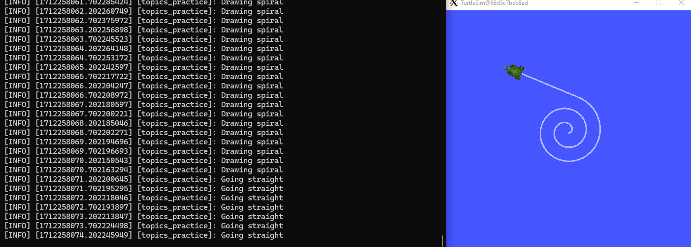

Writing publisher and subscriber nodes. C++
==========================

.. _Writing pubsub cpp:

It is already known what a node is, as such, the following section of the course is devoted to show the coding of nodes capable of publishing and subscribing to a topic. The code in this section will be developed in C++. 

Publisher node in C++
------------------------

Make sure to be in a `brand new terminal`_ window and no ROS command is currently running. 

.. _`brand new terminal`: https://ros2course.readthedocs.io/en/latest/Installation%20and%20software%20setup.html#running-a-docker-container

It will be necessary first to create a new package. This package should be contained in the ``ros2_ws`` workspace, within its ``/src`` folder. The name provided to this new package will be ``cpp_pubsub``.

.. code-block:: console

   ros2 pkg create --build-type ament_cmake --license Apache-2.0 cpp_pubsub

For more reference on package creation consult the `package creation`_ section.

.. _package creation: https://ros2course.readthedocs.io/en/latest/Configuring%20environment.html#creating-and-configuring-a-package

Inside this package, spsecifically in ``cpp_pubsub/src`` create a C++ script, name it ``publisher_script.cpp``.

Copy this content into the new cpp script. 

.. code-block:: cpp

   #include <chrono>
   #include <functional>
   #include <memory>
   #include <string>

   #include "rclcpp/rclcpp.hpp"
   #include "std_msgs/msg/string.hpp"

   using namespace std::chrono_literals;

   /* This example creates a subclass of Node and uses std::bind() to register a
   * member function as a callback from the timer. */

   class MinimalPublisher : public rclcpp::Node
   {
   public:
      MinimalPublisher()
      : Node("minimal_publisher"), count_(0)
      {
         publisher_ = this->create_publisher<std_msgs::msg::String>("topic", 10);
         timer_ = this->create_wall_timer(
         500ms, std::bind(&MinimalPublisher::timer_callback, this));
      }

   private:
      void timer_callback()
      {
         auto message = std_msgs::msg::String();
         message.data = "Hello, world! " + std::to_string(count_++);
         RCLCPP_INFO(this->get_logger(), "Publishing: '%s'", message.data.c_str());
         publisher_->publish(message);
      }
      rclcpp::TimerBase::SharedPtr timer_;
      rclcpp::Publisher<std_msgs::msg::String>::SharedPtr publisher_;
      size_t count_;
   };

   int main(int argc, char * argv[])
   {
      rclcpp::init(argc, argv);
      rclcpp::spin(std::make_shared<MinimalPublisher>());
      rclcpp::shutdown();
      return 0;
   }

1. Publisher, cpp. Examining the code. 
~~~~~~~~~~~~~~~~~~~~~~~~~~~~~~~~~~~~~~~~

The first lines correspond to import libraries.

.. code-block:: cpp
   
   #include <chrono>
   #include <functional>
   #include <memory>
   #include <string>

   #include "rclcpp/rclcpp.hpp"
   #include "std_msgs/msg/string.hpp"

   using namespace std::chrono_literals;

- ``#include <chrono>``:  This is a standard library in C++ that provides facilities for measuring time.
- ``#include <functional>``: This is a standard library in C++ that provides tools for working with function objects and function pointers.
- ``#include <memory>``: This is a standard library in C++ that provides smart pointers and memory management utilities.
- ``#include <string>``: This is a standard library in C++ that provides string handling capabilities.
- ``#include "rclcpp/rclcpp.hpp"``: This includes the ROS 2 C++ library header ``rclcpp.hpp``, which contains the core functionality of the ROS 2 client library for C++.
- ``#include "std_msgs/msg/string.hpp"``: This includes the ROS 2 message header ``string.hpp`` from the ``std_msgs/msg package``. This header defines the message type ``std_msgs::msg::String``.
- ``using namespace std::chrono_literals;``: This brings the ``std::chrono_literals`` namespace into the current scope. It allows the use of time literals like 500ms, representing 500 milliseconds.

All the imported headers ``.hpp`` must be specified in the dependencies file called ``package.xml``. More about this, later in the tutorial, in the :ref:`Adding dependencies section.<2. Publisher, cpp. Adding dependencies>`.

Next, a class is created:

.. code-block:: cpp
   
   class MinimalPublisher : public rclcpp::Node
   {
   public:
      MinimalPublisher()
      : Node("minimal_publisher"), count_(0)
      {
         publisher_ = this->create_publisher<std_msgs::msg::String>("topic", 10);
         timer_ = this->create_wall_timer(
         500ms, std::bind(&MinimalPublisher::timer_callback, this));
      }

   private:
      void timer_callback()
      {
         auto message = std_msgs::msg::String();
         message.data = "Hello, world! " + std::to_string(count_++);
         RCLCPP_INFO(this->get_logger(), "Publishing: '%s'", message.data.c_str());
         publisher_->publish(message);
      }
      rclcpp::TimerBase::SharedPtr timer_;
      rclcpp::Publisher<std_msgs::msg::String>::SharedPtr publisher_;
      size_t count_;
   };

- A class named ``MinimalPublisher`` is derived from ``rclcpp::Node`` class. 
- As attributes that belong to the ``MinimalPublisher`` class (``private`` section), three variables are created:

   - ``rclcpp::TimerBase::SharedPtr timer_``. An object of type ``rclcpp::TimerBase::SharedPtr``.
   - ``rclcpp::Publisher<std_msgs::msg::String>::SharedPtr publisher_``. An object of type ``rclcpp::Publisher<std_msgs::msg::String>::SharedPtr``.
   - ``size_t count_``. An object of type ``size_t``. This type of data is typically used for count of bytes.
- The constructor of the class is defined. For that, ``MinimalPublisher(): Node("minimal_publisher"), count_(0)`` is issued. It initializes the node with the name ``minimal_publisher`` and initializes the ``count_`` member variable of the ``MinimalPublisher`` class to 0.
- Inside the constructor, it is created a publisher for publishing messages of type ``std_msgs::msg::String`` on the topic named ``topic`` with a queue size of 10. 
- Also, inside the constructor, a timer with a period of 500 milliseconds is created. The ``create_wall_timer`` function calls the ``timer_callback`` function using ``std::bind``.
- As part of the ``private`` section of the class, a ``void`` function is defined, this is the callback function of name ``timer_callback``. This function performs:

   - Declares a variable message of type ``std_msgs::msg::String``, which will hold the message to be published.
   - Sets the data field of the message. It concatenates ``Hello, world!`` with the current value of ``count_`` converted to a string and increments ``count_``.
   - Logs an informational message indicating that a message is being published.
   - Publishes the message using the ``publisher_`` member variable.

Lastly, the main function is defined.

.. code-block:: cpp

   int main(int argc, char * argv[])
   {
      rclcpp::init(argc, argv);
      rclcpp::spin(std::make_shared<MinimalPublisher>());
      rclcpp::shutdown();
      return 0;
   }

- First the rclcpp library is initialized.
- Then, ``rclcpp::spin(std::make_shared<MinimalPublisher>());`` creates a shared pointer to an instance of ``MinimalPublisher`` and spins the ROS event loop.
- When the program gets stopped by hitting Ctrl+C, the ``rclcpp::shutdown();`` command shuts down the ROS 2 client library.
- And finally ``return 0;:`` returns 0 to indicate successful program execution.

2. Publisher, cpp. Adding dependencies
~~~~~~~~~~~~~~~~~~~~~~~~~~~~~~~~~~~~~~~~~

Once the cpp script is ready, make sure the dependencies to run this script are correctly configured in the ROS 2 environment. Navigate to ``cpp_pubsub/package.xml`` and add the following just below the ``<buildtool_depend>`` tag:

.. code-block:: console

   <depend>rclcpp</depend>
   <depend>std_msgs</depend>

The final structure should resemble the following:

About the tags found in the ``package.xml``:

- ``<buildtool_depend>``  tag specifies the build tool dependencies required to build the package. These are tools necessary for building the package itself, such as compilers, build systems, or other tools needed during the build process. 
- ``<depend>`` tag specifies the runtime dependencies required for using the package. These are other ROS 2 packages or system dependencies that your package relies on to function correctly during runtime.  
- ``<test_depend>`` tag specifies the dependencies required for running tests associated with the package. These dependencies are only needed when running tests, not during the regular runtime operation of the package. 

3. Publisher, cpp. CMakeLists.txt
~~~~~~~~~~~~~~~~~~~~~~~~~~~~~~~~~

Navigate to ``cpp_pubsub/CMakeLists.txt`` and add the following below the existing dependency ``find_package(ament_cmake REQUIRED)``:

.. code-block:: console

   find_package(rclcpp REQUIRED)
   find_package(std_msgs REQUIRED)

Just below the recently added commands add the executable and name it ``talker``:

.. code-block:: console

   add_executable(talker src/publisher_script.cpp)
   ament_target_dependencies(talker rclcpp std_msgs)

After this addition, include the following:

.. code-block:: console

   install(TARGETS
   talker
   DESTINATION lib/${PROJECT_NAME})

Once everything is added, the ``CMakeLists.txt`` file should be similar to:

4. Build publisher node and run
~~~~~~~~~~~~~~~~~~~~~~~~~~~~~~~
At this point the script is created, the dependencies configured and the ``CMakeLists.txt`` file is correclty setup. 

`brand new terminal`_, make sure that no other ROS2 command is currently running, navigate to the workspace directory and execute either of these two commands:

.. code-block:: console
   
   colcon build --packages-select cpp_pubsub
   colcon build

The first command will build only the specified package. While the second one will build all packages of the workspace. 

If the first command was used, a message similar to this one, should be expected after building the workspace:

.. code-block:: console
   
   Starting >>> cpp_pubsub
   Finished <<< cpp_pubsub [13.7s]

   Summary: 1 package finished [16.7s]

Now, source the setup file:

.. code-block:: console
   
   source install/setup.bash

For more reference on sourcing the setup file, see `sourcing the setup file`_.

.. _sourcing the setup file: https://ros2course.readthedocs.io/en/latest/Configuring%20environment.html#workspace-sourcing

And run the publisher node that was recently created. 

.. code-block:: console
   
   ros2 run cpp_pubsub talker

As a result, something similar to this should be displayed in the terminal window.

.. code-block:: console
   
   [INFO] [1712242926.721032320] [minimal_publisher]: Publishing: 'Hello, world! 0'
   [INFO] [1712242927.221001479] [minimal_publisher]: Publishing: 'Hello, world! 1'
   [INFO] [1712242927.721011100] [minimal_publisher]: Publishing: 'Hello, world! 2'
   ...

See that every 0.5 seconds a new message will be printed in the terminal window. This is because the callback function in the node code was programmed to be issued every 0.5 seconds. The messages that are printed as well, are part of the program of the node. See the :ref:`code explanation<1. Publisher, cpp. Examining the code.>`, to recall the programming behind the publisher node. 

`Open a new terminal`_ and with the ``talker`` node still being running, execute:

.. _open a new terminal: https://ros2course.readthedocs.io/en/latest/Installation%20and%20software%20setup.html#opening-a-new-terminal-for-the-docker-container

.. code-block:: console
   
   ros2 topic echo /topic

This will result in something similar to:

.. code-block:: console
   
   data: Hello, world! 17
   ---
   data: Hello, world! 18
   ---
   data: Hello, world! 19
   ---
   data: Hello, world! 20
   ---
   ...

This is expected since it is known that the ``talker`` node publishes messages to the topic of name ``/topic``. 

Finally, it can be verified the name of the node by executing the following in a `new terminal`_.

.. _new terminal: https://ros2course.readthedocs.io/en/latest/Installation%20and%20software%20setup.html#opening-a-new-terminal-for-the-docker-container

.. code-block:: console
   
   ros2 node list

The result should be similar to this:

.. code-block:: console
   
   /minimal_publisher
   /rqt_gui_py_node_825

As explained in the `python publisher node`_ section, it is important to distinguish these three elements:

.. _python publisher node: https://ros2course.readthedocs.io/en/latest/Writing%20publisher%20and%20subscriber%20nodes.%20Python.html#build-publisher-node-and-run

1. The cpp script name.
2. The node name. 
3. The executable name. 

And from now on, these three will carry the same name to avoid confussions. 

Subscriber node in cpp
-------------------------

Navigate to ``cpp_pubsub/src`` and create a cpp script called: ``listener.cpp``. Copy this content into the new cpp script. 

.. code-block:: cpp
   
   #include <memory>

   #include "rclcpp/rclcpp.hpp"
   #include "std_msgs/msg/string.hpp"
   using std::placeholders::_1;

   class MinimalSubscriber : public rclcpp::Node
   {
   public:
      MinimalSubscriber()
      : Node("listener")
      {
         subscription_ = this->create_subscription<std_msgs::msg::String>(
         "topic", 10, std::bind(&MinimalSubscriber::topic_callback, this, _1));
      }

   private:
      void topic_callback(const std_msgs::msg::String & msg) const
      {
         RCLCPP_INFO(this->get_logger(), "I heard: '%s'", msg.data.c_str());
      }
      rclcpp::Subscription<std_msgs::msg::String>::SharedPtr subscription_;
   };

   int main(int argc, char * argv[])
   {
      rclcpp::init(argc, argv);
      rclcpp::spin(std::make_shared<MinimalSubscriber>());
      rclcpp::shutdown();
      return 0;
   }

1. Subscriber, cpp. Examining the code. 
~~~~~~~~~~~~~~~~~~~~~~~~~~~~~~~~~~~~~~~~~~

Overall, the code for the subscriber node is similar to the publisher node. 

The first lines correspond to import libraries. These are the same libraries as in the :ref:`publisher node example<1. Publisher, cpp. Examining the code. >`. 

.. code-block:: cpp
   
   #include <memory>
   #include "rclcpp/rclcpp.hpp"
   #include "std_msgs/msg/string.hpp"
   using std::placeholders::_1;

With an exception, that not all libraries that were used in the publisher are used in the subscriber. Additionally, the ``using std::placeholders::_1`` command is new here; it brings the ``_1`` placeholder into the current scope. ``_1`` is used in binding member functions to arguments with ``std::bind``.

Next, a class is created:

.. code-block:: cpp
   
   class MinimalSubscriber : public rclcpp::Node
   {
   public:
      MinimalSubscriber()
      : Node("listener")
      {
         subscription_ = this->create_subscription<std_msgs::msg::String>(
         "topic", 10, std::bind(&MinimalSubscriber::topic_callback, this, _1));
      }

   private:
      void topic_callback(const std_msgs::msg::String & msg) const
      {
         RCLCPP_INFO(this->get_logger(), "I heard: '%s'", msg.data.c_str());
      }
      rclcpp::Subscription<std_msgs::msg::String>::SharedPtr subscription_;
   };

The constructor of the ``MinimalSubscriber`` class creates a node of name ``listener`` and issues the ``create_subscription()`` function, which will handle messages of type  ``std_msgs::msg::String`` and will perform a subscription to the topic named ``topic``, with queue size of 10 and bind the ``topic_callback`` member function to handle messages received on this subscription.

Afterwards, the implementation of the ``topic_callback`` callback function simply consists on printing the message received in the terminal window. Additionally, also as a member of the class, it is created of course, a variable of type ``rclcpp::Subscription<std_msgs::msg::String>::SharedPtr`` that is required to handle the ``create_subscription()`` function.

Lastly, the main function, as in the publisher node, it initializes the ``rclcpp`` library, creates the subscription node, spins it, shuts down the ROS 2 client library, when a stoppage is issued from the terminal window and finally return 0 indicating a successful execution of the program.

.. code-block:: cpp

   int main(int argc, char * argv[])
   {
      rclcpp::init(argc, argv);
      rclcpp::spin(std::make_shared<MinimalSubscriber>());
      rclcpp::shutdown();
      return 0;
   }

2. Subscriber, cpp. Adding dependencies
~~~~~~~~~~~~~~~~~~~~~~~~~~~~~~~~~~~~~~~~~~

As the libraries to use in this program are the same as in the publisher node, then no new dependency should be added. If, for some reason, it were going to be used a new library in the subscriber node, then that library should be added as a dependecy in the ``cpp_pubsub/package.xml`` file.

3. Subscriber, cpp. CMakeLists.txt
~~~~~~~~~~~~~~~~~~~~~~~~~~~~~~~~~~~~~~~~~~~~

Navigate to ``cpp_pubsub/CMakeLists.txt`` and add the following below the publisher's entries:

.. code-block:: txt
   
   add_executable(listener src/subscriber_member_function.cpp)
   ament_target_dependencies(listener rclcpp std_msgs)

   install(TARGETS
      talker
      listener
      DESTINATION lib/${PROJECT_NAME})

Optionally, it can be deleted this portion of the code, since it is repeated:

.. code-block:: txt
      
   install(TARGETS
      talker
      DESTINATION lib/${PROJECT_NAME})

The ``CMakeLists.txt`` should be similar to the following:

4. Build subscriber node and run
~~~~~~~~~~~~~~~~~~~~~~~~~~~~~~~~

At this point the script is created, the dependencies configured and the ``CMakeLists.txt`` file correclty setup. 

Open a `brand new terminal`_, make sure that no other ROS 2 command are currently running, navigate to the workspace directory and execute:

.. code-block:: console
   
   colcon build --packages-select cpp_pubsub

Now, source the setup file:

.. code-block:: console
   
   source install/setup.bash

For more reference on sourcing the setup file, see `sourcing the setup file`_.

And run the subscriber node that was recently created. 

.. code-block:: console
   
   ros2 run cpp_pubsub listener

Notice that nothing will be displayed in the terminal window because no messages are currently being sent to the topic that this node is subscribed to.

`Open a new terminal`_ and execute the ``talker`` node:

.. code-block:: console
   
   ros2 run cpp_pubsub talker

After this, return to the terminal where the ``listener`` node was executed. It should be displayed the messages being sent to the topic of name ``topic``.

.. image:: images/listenerNodeResults.png
   :alt: Results from the listener node.

Finally, `open a new terminal`_ and execute:

.. code-block:: console
   
   rqt_graph

See that the two nodes: ``talker`` and ``listener`` are visible and they are publishing and subscribing to ``topic`` respectively.

Practice 
---------

Have ``trutlesim`` node running. Create a new node called ``topics_practice`` that performs:

- A countdown starting at 5 and be displayed in the terminal.
- When counter reaches 0 moves the turtle drawing a growing spiral. Print in the terminal "Drawing spiral".
- When the turtle reaches some pre-defined boundaries in the screen (horizontal and vertical limits defined by the coder), make the turtle advance in a straight line. Print in the terminal "Going straight".

See image below for an example of the results:

Optional
~~~~~~~~

Have ``trutlesim`` node running. Create a new node called ``topics_practice_b`` that performs:

- The same as ``topics_practice`` but add the turtle, the functionality of avoiding walls. Whenever the turtle is too close to the walls (around one unit away of the wall), make it turn. Print in the terminal "Avoiding walls".
