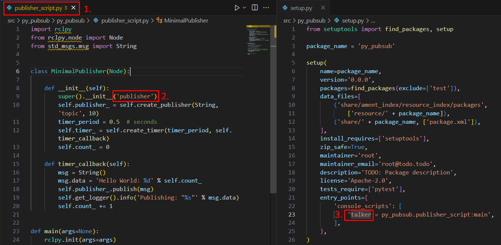

Writing publisher and subscriber nodes. Python
==========================

.. _Writing pubsub python:

It is already known what a node is, as such, the following section of the course is devoted to show the coding of nodes capable of publishing and subscribing to a topic. The code in this section will be developed in python. 

Publisher node in python
------------------------

Make sure to be in a `brand new terminal`_ window and no ROS command is currently running. 

.. _`brand new terminal`: https://ros2course.readthedocs.io/en/latest/Installation%20and%20software%20setup.html#running-a-docker-container

It will be necessary first to create a new package. This package should be contained in the ``ros2_ws`` workspace, within its ``/src`` folder. The name provided to this new package will be ``py_pubsub``.

.. code-block:: console

   ros2 pkg create --build-type ament_python --license Apache-2.0 py_pubsub

For more reference on package creation consult the `package creation`_ section.

.. _package creation: https://ros2course.readthedocs.io/en/latest/Configuring%20environment.html#creating-and-configuring-a-package

Inside this package, spsecifically in ``py_pubsub/py_pubsub`` create a python script, name it ``publisher_script.py``.

Copy this content into the new python script. 

.. code-block:: python

   import rclpy
   from rclpy.node import Node
   from std_msgs.msg import String

   class MinimalPublisher(Node):

      def __init__(self):
         super().__init__('publisher')
         self.publisher_ = self.create_publisher(String, 'topic', 10)
         timer_period = 0.5  # seconds
         self.timer_ = self.create_timer(timer_period, self.timer_callback)
         self.count_ = 0

      def timer_callback(self):
         msg = String()
         msg.data = 'Hello World: %d' % self.count_
         self.publisher_.publish(msg)
         self.get_logger().info('Publishing: "%s"' % msg.data)
         self.count_ += 1

   def main(args=None):
      rclpy.init(args=args)

      minimal_publisher = MinimalPublisher()

      rclpy.spin(minimal_publisher)

      minimal_publisher.destroy_node()
      rclpy.shutdown()

   if __name__ == '__main__':
      main()

1. Publisher, python. Examining the code. 
~~~~~~~~~~~~~~~~~~~~~~~~~~~~~~~~~~~~~~~~

The first lines correspond to import libraries.

.. code-block:: python
   
   import rclpy
   from rclpy.node import Node
   from std_msgs.msg import String

- ``rclpy`` is a Python client library for ROS 2. It provides Python bindings for the ROS 2 middleware, enabling developers to write ROS 2 nodes and applications using the Python programming language.
- ``from rclpy.node import Node`` imports the ``Node`` class from the ``rclpy.node`` module.
- ``from std_msgs.msg import String`` imports the ``String`` message type from the ``std_msgs.msg`` module.

All these imported libraries must be specified in the dependencies file called ``package.xml``. More about this, later in the tutorial. 

Next, a class is created:

.. code-block:: python
   
   class MinimalPublisher(Node):

      def __init__(self):
         super().__init__('publisher')
         self.publisher_ = self.create_publisher(String, 'topic', 10)
         timer_period = 0.5  # seconds
         self.timer_ = self.create_timer(timer_period, self.timer_callback)
         self.count_ = 0

      def timer_callback(self):
         msg = String()
         msg.data = 'Hello World: %d' % self.count_
         self.publisher_.publish(msg)
         self.get_logger().info('Publishing: "%s"' % msg.data)
         self.count_ += 1

- A class of name ``MinimalPublisher`` is created and it inherits from class ``Node``.
- The constructor of the class is defined, for that, ``super().__init__('publisher')`` is issued. This is a call to the ``Node`` class' constructor function. Additionally, it is assigned a node name, which is ``publisher``.
- Afterwards, an attribute of name ``publisher_`` is created and stores the result of ``create_publisher()``, which defines an object that publishes messages of type String, over a topic named ``topic``, with a ``queue size`` of 10. Queue size is a required QoS (quality of service) setting that limits the amount of queued messages if a subscriber is not receiving them fast enough. 

The ``create_publisher()`` function belongs to the ``rclpy.node.Node`` class and it has the following structure:

.. code-block:: console
   
   create_publisher(<msg_type>, <topic>, <qos_profile>, *, <callback_group=None>, <event_callbacks=None>)

- An attribute of name ``timer_`` is created and stores the result of ``create_timer()``, which defines a timer with 0.5 of time period attached to a callback function of name ``timer_callback``. Again, the ``create_timer()`` function belongs to the ``rclpy.node.Node`` class and it has the following structure:

.. code-block:: console
   
   create_timer(<timer_period_sec>, <callback>, <callback_group=None>, <clock=None>)

- Next, the definition of the callback function is coded; this will be invoked every 0.5 seconds, as it was configured in the ``create_timer()`` function. 
- First, a message of type ``String()`` is created and its content is filled with a ``Hello World`` message followed by a counter that starts at 0.
- The ``publisher_`` attribute is issued to publish the message.
- The message is published to the console with the ``self.get_logger().info('Publishing: "%s"' % msg.data)`` line.
- And the counter attribute is increased in one.

Lastly, the main function is defined.

.. code-block:: python

   def main(args=None):
      rclpy.init(args=args)

      minimal_publisher = MinimalPublisher()

      rclpy.spin(minimal_publisher)

      minimal_publisher.destroy_node()
      rclpy.shutdown()

- First the rclpy library is initialized.
- A node is created by instantiating an object of the ``MinimalPublisher`` class.
- ``rclpy.spin(minimal_publisher)`` starts the ROS 2 event loop for the specified node (``minimal_publisher``). The event loop is responsible for processing messages, handling callbacks, and maintaining the communication infrastructure of the ROS 2 system. 
- ``minimal_publisher.destroy_node()`` explicitly destroys the node represented by ``minimal_publisher``.
- ``rclpy.shutdown()`` shuts down the ROS 2 system. It releases resources allocated by the ROS2 middleware and cleans up the environment.

2. Publisher, python. Adding dependencies
~~~~~~~~~~~~~~~~~~~~~~~~~~~~~~~~~~~~~~~~~

Once the python script is ready, make sure the dependencies to run this script are correctly configured in the ROS 2 environment. Navigate to ``py_pubsub/package.xml`` and add the following just below the ``<license>`` tag:

.. code-block:: console

   <exec_depend>rclpy</exec_depend>
   <exec_depend>std_msgs</exec_depend>

The final structure should resemble the following:

About the tags found in the ``package.xml``:

- ``<exec_depend>`` tag indicates a runtime dependency. It means that the package requires the specified dependency to be available during execution. This means that when the package is run, it expects ``std_msgs`` or ``rclpy`` to be installed and available.
- ``<test_depend>`` tag indicates a dependency required for testing purposes. It means that the package needs the specified dependency to run its tests. 

3. Publisher, python. Adding an entry point
~~~~~~~~~~~~~~~~~~~~~~~~~~~~~~~~~~~~~~~~~~~

Navigate to ``py_pubsub/setup.py`` and add the following within the ``console_scripts`` brackets of the ``entry_points`` field:

.. code-block:: console

   entry_points={
         'console_scripts': [
                  'talker = py_pubsub.publisher_script:main',
         ],
   },

4. Build publisher node and run
~~~~~~~~~~~~~~~~~~~~~~~~~~~~~~~
At this point the script is created, the dependencies configured and the entry point correclty setup. 

Open a `brand new terminal`_, make sure that no other ROS2 command is currently running, navigate to the workspace directory and execute either of these two commands:

.. code-block:: console
   
   colcon build
   colcon build --symlink-install

The first command will build all the packages contained in the workspace; it will build them by copying the built artifacts (binaries, libraries, headers, etc.) into an install directory. While the second one, will also build all the packages contained in the workspace, but rather than copying the built artifacts, it will use symbolic links to these ones. The way the built artifacts are handled results in having to execute ``colcon build`` every time a change is performed in the source code to see their effects, while with ``colcon build --symlink-install``, every time a change is performed in the source code, it will not be necessary to perform the building operation afterwards. Hence, for the moment it is preferred to use ``colcon build --symlink-install`` to avoid building the workspace after every change in the source code.

A message similar to this one, should be expected after building the workspace:

.. code-block:: console
   
   Starting >>> my_first_package
   Starting >>> py_pubsub
   Finished <<< py_pubsub [4.62s]
   Finished <<< my_first_package [5.13s]

   Summary: 2 packages finished [6.44s]

Now, source the setup file:

.. code-block:: console
   
   source install/setup.bash

For more reference on sourcing the setup file, see `sourcing the setup file`_.

.. _sourcing the setup file: https://ros2course.readthedocs.io/en/latest/Configuring%20environment.html#workspace-sourcing

And run the publisher node that was recently created. 

.. code-block:: console
   
   ros2 run py_pubsub talker

As a result, something similar to this should be displayed in the terminal window.

.. code-block:: console
   
   [INFO] [1712152551.805539058] [publisher]: Publishing: "Hello World: 0"
   [INFO] [1712152552.225817483] [publisher]: Publishing: "Hello World: 1"
   [INFO] [1712152552.725589332] [publisher]: Publishing: "Hello World: 2"
   ...

See that every 0.5 seconds a new message will be printed in the terminal window. This is because the callback function in the node code was programmed to be issued every 0.5 seconds. The messages that are printed as well, are part of the program of the node. See the :ref:`code explanation<1. Examining the code. Python code>`, to recall the programming behind the publisher node. 

`Open a new terminal`_ and with the ``talker`` node still being running, execute:

.. _open a new terminal: https://ros2course.readthedocs.io/en/latest/Installation%20and%20software%20setup.html#opening-a-new-terminal-for-the-docker-container

.. code-block:: console
   
   ros2 topic echo /topic

This will result in something similar to:

.. code-block:: console
   
   data: 'Hello World: 121'
   ---
   data: 'Hello World: 122'
   ---
   data: 'Hello World: 123'
   ---
   ...

This is expected since it is known that the ``talker`` node publishes messages to the topic of name ``/topic``. 

Finally, it can be verified the name of the node by executing the following in a `new terminal`_.

.. _new terminal: https://ros2course.readthedocs.io/en/latest/Installation%20and%20software%20setup.html#opening-a-new-terminal-for-the-docker-container

.. code-block:: console
   
   ros2 node list

The expected result is:

.. code-block:: console
   
   /publisher

At this point it is important to distinguish these three elements:

1. This is the python script name.
2. This is the node name. 
3. This is the executable name. 

And from now on, these three will carry the same name to avoid confussions. 

Subscriber node in python
-------------------------

Navigate to ``py_pubsub/py_pubsub`` and create a python script called: ``listener.py``. Copy this content into the new python script. 

.. code-block:: python
   
   import rclpy
   from rclpy.node import Node

   from std_msgs.msg import String

   class MinimalSubscriber(Node):

      def __init__(self):
         super().__init__('listener')
         self.subscription_ = self.create_subscription(
               String,
               'topic',
               self.listener_callback,
               10)
         self.subscription_  # prevent unused variable warning

      def listener_callback(self, msg):
         self.get_logger().info('I heard: "%s"' % msg.data)

   def main(args=None):
      rclpy.init(args=args)

      minimal_subscriber = MinimalSubscriber()

      rclpy.spin(minimal_subscriber)

      minimal_subscriber.destroy_node()
      rclpy.shutdown()

   if __name__ == '__main__':
      main()

1. Subscriber, python. Examining the code. 
~~~~~~~~~~~~~~~~~~~~~~~~~~~~~~~~~~~~~~~~~~

Overall, the code for the subscriber node is similar to the publisher node. 

The first lines correspond to import libraries. These are the same libraries as in the :ref:`publisher node example<1. Publisher, python. Examining the code. >`. 

.. code-block:: python
   
   import rclpy
   from rclpy.node import Node
   from std_msgs.msg import String

Next, a class is created:

.. code-block:: python
   
   class MinimalSubscriber(Node):

      def __init__(self):
         super().__init__('listener')
         self.subscription_ = self.create_subscription(
               String,
               'topic',
               self.listener_callback,
               10)
         self.subscription_  # prevent unused variable warning

      def listener_callback(self, msg):
         self.get_logger().info('I heard: "%s"' % msg.data)

The constructor of the ``MinimalSubscriber`` class issues the ``create_subscription()`` function, which receives as arguments: ``String``, as the message type; ``topic``, as the topic to subscribe to; ``self.listener_callback``, as the callback function to be called every time a message arrives to the topic, and a queue size of 10. The structure for the ``create_subscription()`` function is given by:

.. code-block:: python
   
   create_subscription(<msg_type>, <topic>, <callback>, <qos_profile>, *, <callback_group=None>, <event_callbacks=None>, <raw=False>)

Afterwards, the callback function simply prints the message received in the terminal window.

Lastly, the main function, as in the publisher node, initializes the rclpy library, creates the subscription node, spins it, explicitely destroys it when issued from the terminal window and shuts down the ROS 2 system.

.. code-block:: python

   def main(args=None):
      rclpy.init(args=args)

      minimal_publisher = MinimalPublisher()

      rclpy.spin(minimal_publisher)

      minimal_publisher.destroy_node()
      rclpy.shutdown()

2. Subscriber, python. Adding dependencies
~~~~~~~~~~~~~~~~~~~~~~~~~~~~~~~~~~~~~~~~~~

As the libraries to use in this program are exactly the same as in the publisher node, then no new dependency should be added. If, for some reason, it were going to be used a new library in the subscriber node, then that library should be added as a dependecy in the ``py_pubsub/package.xml`` file.

3. Subscriber, python. Adding an entry point
~~~~~~~~~~~~~~~~~~~~~~~~~~~~~~~~~~~~~~~~~~~~

Navigate to ``py_pubsub/setup.py`` and add the following within the ``console_scripts`` brackets of the ``entry_points`` field:

.. code-block:: console
   
   'listener = py_pubsub.listener:main'

This ``entry_points`` field should be remain like this:

.. code-block:: console

   entry_points={
        'console_scripts': [
            'talker = py_pubsub.publisher_script:main',
            'listener = py_pubsub.listener:main'
        ],
   },

4. Build subscriber node and run
~~~~~~~~~~~~~~~~~~~~~~~~~~~~~~~~

At this point the script is created, the dependencies configured and the entry point correclty setup. 

Open a `brand new terminal`_ in the Docker session, make sure that no other ROS 2 command are currently running, navigate to the workspace directory and execute:

.. code-block:: console
   
   colcon build --symlink-install

As it was explained in the :ref:`publisher node part<Build publisher node and run>`, this will build all packages of the workspace. 

Now, source the setup file:

.. code-block:: console
   
   source install/setup.bash

For more reference on sourcing the setup file, see `this section`_ .

.. _this section: https://ros2course.readthedocs.io/en/latest/Configuring%20environment.html#workspace-sourcing

And run the subscriber node that was recently created. 

.. code-block:: console
   
   ros2 run py_pubsub listener

Notice that nothing will be displayed in the terminal window because no messages are currently being sent to the topic that this node is subscribed to.

`Open a new terminal`_ and execute the ``talker`` node:

.. code-block:: console
   
   ros2 run py_pubsub talker

After this, return to the terminal where the ``listener`` node was executed. It should be displayed the messages being sent to the topic of name ``topic``.

Finally, `open a new terminal`_ and execute:

.. code-block:: console
   
   rqt_graph

See that the two nodes: ``talker`` and ``listener`` are visible and they are publishing and subscribing to ``topic`` respectively.

Practice 
---------

Have ``trutlesim`` node running. Create a new node called ``topics_practice`` that performs:

- A countdown starting at 5 and be displayed in the terminal.
- When counter reaches 0 moves the turtle drawing a growing spiral. Print in the terminal "Drawing spiral".
- When the turtle reaches some pre-defined boundaries in the screen (horizontal and vertical limits defined by the coder), make the turtle advance in a straight line. Print in the terminal "Going straight".

See image below for an example of the results:

Optional
~~~~~~~~

Have ``trutlesim`` node running. Create a new node called ``topics_practice_b`` that performs:

- The same as ``topics_practice`` but add the turtle, the functionality of avoiding walls. Whenever the turtle is too close to the walls (around one unit away of the wall), make it turn. Print in the terminal "Avoiding walls".
