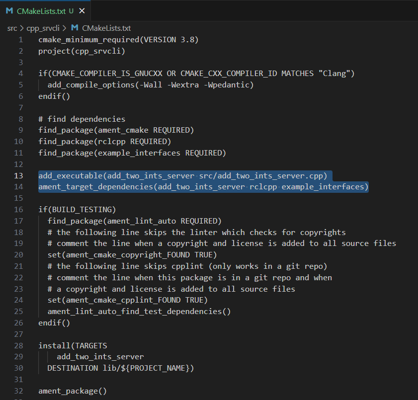
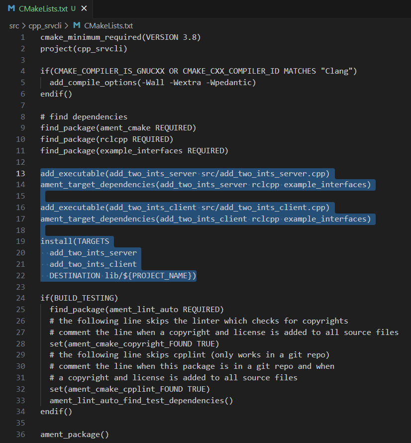
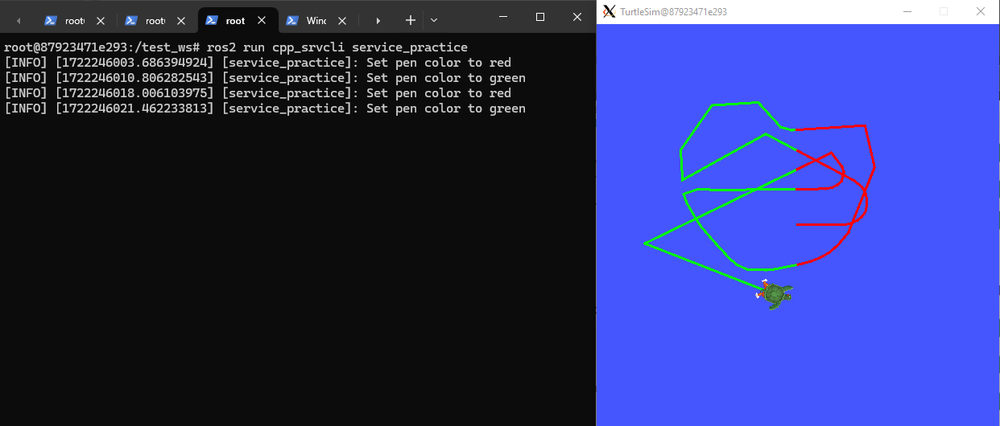
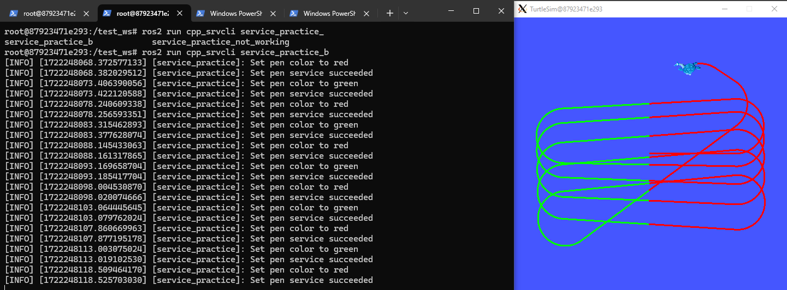
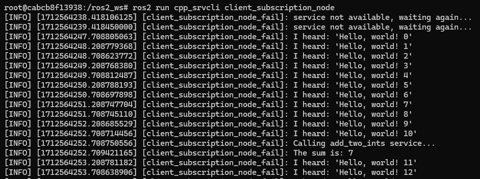
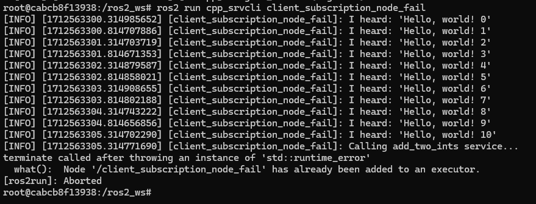

Writing service and client. C++
==========================

.. _Writing service client cpp:

This sections shows how nodes can communicate with each other through services. The node that sends a request is called the client node, while the node that responds to the request sending the response is called the service node. The programs for the client and service nodes will be developed in C++.  

Setup for working with services
------------------------

Make sure to be in a `brand new terminal`_ window and no ROS command is currently running. 

.. _`brand new terminal`: https://ros2course.readthedocs.io/en/latest/Installation%20and%20software%20setup.html#running-a-docker-container

Create a new package. This package should be contained in the ``ros2_ws`` workspace, within its ``/src`` folder. The name provided to this new package will be ``cpp_srvcli``.

.. code-block:: console

   ros2 pkg create --build-type ament_cmake --license Apache-2.0 cpp_srvcli --dependencies rclcpp example_interfaces

The ``--dependencies`` argument will automatically add the necessary dependency lines to ``package.xml``. In this case, ``example_interfaces`` is the package that includes the ``AddTwoInts.srv`` file that is needed to structure the requests and responses of this example. See below its data structure:

.. code-block:: console

   int64 a
   int64 b
   ---
   int64 sum

For more reference on package creation consult the `package creation`_ section.

.. _package creation: https://ros2course.readthedocs.io/en/latest/Configuring%20environment.html#creating-and-configuring-a-package

Writing the service node. C++
------------------------

Inside this package, spsecifically in ``cpp_srvcli/src`` create a cpp script, name it ``add_two_ints_server.cpp``.

Copy this content into the new cpp script. 

.. code-block:: cpp

   #include "rclcpp/rclcpp.hpp"
   #include "example_interfaces/srv/add_two_ints.hpp"

   #include <memory>

   void add(const std::shared_ptr<example_interfaces::srv::AddTwoInts::Request> request,
            std::shared_ptr<example_interfaces::srv::AddTwoInts::Response>      response)
   {
      response->sum = request->a + request->b;
      RCLCPP_INFO(rclcpp::get_logger("rclcpp"), "Incoming request\na: %ld" " b: %ld",
                     request->a, request->b);
      RCLCPP_INFO(rclcpp::get_logger("rclcpp"), "sending back response: [%ld]", (long int)response->sum);
   }

   int main(int argc, char **argv)
   {
      rclcpp::init(argc, argv);

      std::shared_ptr<rclcpp::Node> node = rclcpp::Node::make_shared("add_two_ints_server");

      rclcpp::Service<example_interfaces::srv::AddTwoInts>::SharedPtr service =
         node->create_service<example_interfaces::srv::AddTwoInts>("add_two_ints", &add);

      RCLCPP_INFO(rclcpp::get_logger("rclcpp"), "Ready to add two ints.");

      rclcpp::spin(node);
      rclcpp::shutdown();
   }

1. Service node, C++. Examining the code. 
~~~~~~~~~~~~~~~~~~~~~~~~~~~~~~~~~~~~~~~~

The first lines correspond to import libraries.

.. code-block:: cpp

   #include "rclcpp/rclcpp.hpp"
   #include "example_interfaces/srv/add_two_ints.hpp"

   #include <memory>

- ``#include "rclcpp/rclcpp.hpp"``: This includes the ROS 2 C++ library header ``rclcpp.hpp``, which contains the core functionality of the ROS 2 client library for C++.
- ``#include "example_interfaces/srv/add_two_ints.hpp"``: This includes the header file for the ``AddTwoInts`` service message type. This is necessary to use the ``AddTwoInts`` service.
- ``#include <memory>``: This is a standard library in C++ that provides smart pointers and memory management utilities.

Next, a void method is implemented

.. code-block:: cpp
 
   void add(const std::shared_ptr<example_interfaces::srv::AddTwoInts::Request> request,
               std::shared_ptr<example_interfaces::srv::AddTwoInts::Response>      response)
   {
      response->sum = request->a + request->b;
      RCLCPP_INFO(rclcpp::get_logger("rclcpp"), "Incoming request\na: %ld" " b: %ld",
                     request->a, request->b);
      RCLCPP_INFO(rclcpp::get_logger("rclcpp"), "sending back response: [%ld]", (long int)response->sum);
   }

- ``void add(const std::shared_ptr<example_interfaces::srv::AddTwoInts::Request> request, std::shared_ptr<example_interfaces::srv::AddTwoInts::Response> response)``: This defines a function named ``add`` that takes two arguments: a shared pointer to the request message (``example_interfaces::srv::AddTwoInts::Request``) and a shared pointer to the response message (``example_interfaces::srv::AddTwoInts::Response``).
- ``response->sum = request->a + request->b;``: This calculates the sum of the two integers ``a`` and ``b`` received in the request and stores the result in the ``sum`` field of the response message.
- ``RCLCPP_INFO(...)``: This logs information messages using the ROS 2 logging mechanism. It prints the incoming request values (``a`` and ``b``) as well as the response value (``sum``) to the console.

Finally, the ``main`` section:

.. code-block:: cpp
   
   int main(int argc, char **argv)
   {
      rclcpp::init(argc, argv);

      std::shared_ptr<rclcpp::Node> node = rclcpp::Node::make_shared("add_two_ints_server");

      rclcpp::Service<example_interfaces::srv::AddTwoInts>::SharedPtr service =
         node->create_service<example_interfaces::srv::AddTwoInts>("add_two_ints", &add);

      RCLCPP_INFO(rclcpp::get_logger("rclcpp"), "Ready to add two ints.");

      rclcpp::spin(node);
      rclcpp::shutdown();
   }

- ``int main(int argc, char **argv)``: This is the entry point of the program. It takes command-line arguments ``argc`` (argument count) and ``argv`` (argument vector).
- ``rclcpp::init(argc, argv);``: This initializes the ROS 2 C++ client library. 
- ``std::shared_ptr<rclcpp::Node> node = rclcpp::Node::make_shared("add_two_ints_server");``: This creates a shared pointer to a ROS 2 node named ``add_two_ints_server``.
- ``rclcpp::Service<example_interfaces::srv::AddTwoInts>::SharedPtr service = node->create_service<example_interfaces::srv::AddTwoInts>("add_two_ints", &add);``: This creates a service server for the ``AddTwoInts`` service. It associates the service with the function ``add`` and registers it with the ROS 2 node.
- ``RCLCPP_INFO(...)``: This logs an information message indicating that the service server is ready to receive requests.
- ``rclcpp::spin(node);``: This blocks the main thread, allowing the ROS 2 node to process callbacks (e.g., incoming service requests).
- ``rclcpp::shutdown();``: This shuts down the ROS 2 node when ``rclcpp::spin()`` returns (e.g., when the program is terminated).

2. Service, C++. Adding dependencies
~~~~~~~~~~~~~~~~~~~~~~~~~~~~~~~~~~~~~~~~~

Once the C++ script is ready, make sure the dependencies to run this script are correctly configured in the ROS 2 environment. Navigate to ``cpp_srvcli/package.xml`` and check that the dependecies are already added for this case, since at the moment of the package creation it was executed: ``--dependencies rclcpp example_interfaces``.

.. code-block:: console

   <depend>rclcpp</depend>
   <depend>example_interfaces</depend>

About the ``<depend>`` tags:

- This tag is a more general declaration of dependency. It's used to specify both build-time and runtime dependencies. ``<depend>`` includes both the dependencies needed for compilation and those needed at runtime. It encompasses a wider range of dependencies compared to ``<exec_depend>``.

3. Service, C++. Adding the executable
~~~~~~~~~~~~~~~~~~~~~~~~~~~~~~~~~~~~~~~~~~~

Navigate to ``cpp_srvcli/CMakeLists.txt`` and add the following below the existing dependency ``find_package(example_interfaces REQUIRED)``:

.. code-block:: console

   add_executable(add_two_ints_server src/add_two_ints_server.cpp)
   ament_target_dependencies(add_two_ints_server rclcpp example_interfaces)

After this addition, include the following to the end of the file, right before ``ament_package()``:

.. code-block:: console

   install(TARGETS
    add_two_ints_server
   DESTINATION lib/${PROJECT_NAME})

Once everything is added, the ``CMakeLists.txt`` file should be similar to:

4. Build server node and run
~~~~~~~~~~~~~~~~~~~~~~~~~~~~~~~
At this point the script is created, the dependencies configured and the ``CMakeLists.txt`` file is correclty setup.  

Open a `brand new terminal`_, make sure that no other ROS 2 command is currently running, navigate to the workspace directory and execute either of these two commands:

.. code-block:: console
   
   colcon build --packages-select cpp_srvcli
   colcon build

The first command will build only the specified package. While the second one will build all packages of the workspace. 

If the first command was used, a message similar to this one, should be expected after building the workspace:

.. code-block:: console
   
   Starting >>> cpp_srvcli
   [Processing: cpp_srvcli]
   Finished <<< cpp_srvcli [37.4s]

   Summary: 1 package finished [41.0s]

Now, source the setup file:

.. code-block:: console
   
   source install/setup.bash

For more reference on sourcing the setup file, see `sourcing the setup file`_.

.. _sourcing the setup file: https://ros2course.readthedocs.io/en/latest/Configuring%20environment.html#workspace-sourcing

And run the server node that was recently created. 

.. code-block:: console
   
   ros2 run cpp_srvcli add_two_ints_server

As a result, the following message will be displayed:

.. code-block:: console
   
   [INFO] [1712330435.947184503] [rclcpp]: Ready to add two ints.

`Open a new terminal`_ and execute:

.. _open a new terminal: https://ros2course.readthedocs.io/en/latest/Installation%20and%20software%20setup.html#opening-a-new-terminal-for-the-docker-container

.. code-block:: console
   
   ros2 service list

This will result in something similar to:

.. code-block:: console
   
   /add_two_ints
   /add_two_ints_server/describe_parameters
   /add_two_ints_server/get_parameter_types
   /add_two_ints_server/get_parameters
   /add_two_ints_server/list_parameters
   /add_two_ints_server/set_parameters
   /add_two_ints_server/set_parameters_atomically

Here, it can be seen that the service that was created in the ``add_two_ints_server.cpp`` cpp script is indeed present and ready to be called, that is: ``/add_two_ints`` service.

Finally, call the ``/add_two_ints`` service. Execute:

.. code-block:: console
   
   ros2 service call /add_two_ints example_interfaces/srv/AddTwoInts "{a: 2, b: 3}"

This will result in:

.. code-block:: console

   requester: making request: example_interfaces.srv.AddTwoInts_Request(a=2, b=3)

   response:
   example_interfaces.srv.AddTwoInts_Response(sum=5)

The service that was created was just called directly from the terminal. 

What is going to be performed next, is to consume this service through a node. Its coding will be shown below.

Client node in C++
-------------------------

Navigate to ``cpp_srvcli/src`` and create a cpp script called: ``add_two_ints_client.cpp``. Copy this content into the new cpp script. 

.. code-block:: cpp   

   #include "rclcpp/rclcpp.hpp"
   #include "example_interfaces/srv/add_two_ints.hpp"

   #include <chrono>
   #include <cstdlib>
   #include <memory>

   using namespace std::chrono_literals;

   int main(int argc, char **argv)
   {
      rclcpp::init(argc, argv);

      if (argc != 3) {
            RCLCPP_INFO(rclcpp::get_logger("rclcpp"), "usage: add_two_ints_client X Y");
            return 1;
   }

   std::shared_ptr<rclcpp::Node> node = rclcpp::Node::make_shared("add_two_ints_client");
   rclcpp::Client<example_interfaces::srv::AddTwoInts>::SharedPtr client =
      node->create_client<example_interfaces::srv::AddTwoInts>("add_two_ints");

   auto request = std::make_shared<example_interfaces::srv::AddTwoInts::Request>();
   request->a = atoll(argv[1]);
   request->b = atoll(argv[2]);

   while (!client->wait_for_service(1s)) {
      if (!rclcpp::ok()) {
         RCLCPP_ERROR(rclcpp::get_logger("rclcpp"), "Interrupted while waiting for the service. Exiting.");
         return 0;
      }
      RCLCPP_INFO(rclcpp::get_logger("rclcpp"), "service not available, waiting again...");
   }

   auto result = client->async_send_request(request);
   // Wait for the result.
   if (rclcpp::spin_until_future_complete(node, result) ==
      rclcpp::FutureReturnCode::SUCCESS)
   {
      RCLCPP_INFO(rclcpp::get_logger("rclcpp"), "Sum: %ld", result.get()->sum);
   } else {
      RCLCPP_ERROR(rclcpp::get_logger("rclcpp"), "Failed to call service add_two_ints");
   }

   rclcpp::shutdown();
   return 0;
   }

1. Service client, cpp. Examining the code. 
~~~~~~~~~~~~~~~~~~~~~~~~~~~~~~~~~~~~~~~~~~

The first lines correspond to import libraries. These are the similar libraries as in the :ref:`service node example<1. Service node, cpp. Examining the code.>`. 

.. code-block:: cpp
   
   #include "rclcpp/rclcpp.hpp"
   #include "example_interfaces/srv/add_two_ints.hpp"

   #include <chrono>
   #include <cstdlib>
   #include <memory>

   using namespace std::chrono_literals;

- ``#include <chrono>``: This includes the ``<chrono>`` header file, which provides facilities for time-related functionality.
- ``#include <cstdlib>``: This includes the ``<cstdlib>`` header file, which provides general utilities.
- ``#include <memory>``: This includes the ``<memory>`` header file, which is necessary for using smart pointers like ``std::shared_ptr``.
- ``using namespace std::chrono_literals;``: This line introduces the ``std::chrono_literals`` namespace, allowing you to use time literals like 1s (1 second) in the code.

Next, the ``main`` function. This will be explained by parts. The first part is:

.. code-block:: cpp
   
   int main(int argc, char **argv)
   {
   rclcpp::init(argc, argv);

   if (argc != 3) {
         RCLCPP_INFO(rclcpp::get_logger("rclcpp"), "usage: add_two_ints_client X Y");
         return 1;
   }

- ``rclcpp::init(argc, argv);``: This initializes the ROS 2 C++ client library. 
- ``if (argc != 3) { ... }``: This condition checks if the program is invoked with exactly 3 arguments (including the program name). If not, it prints usage information and returns with an error code.

Now the second part:

.. code-block:: cpp
   
   std::shared_ptr<rclcpp::Node> node = rclcpp::Node::make_shared("add_two_ints_client");
   rclcpp::Client<example_interfaces::srv::AddTwoInts>::SharedPtr client =
      node->create_client<example_interfaces::srv::AddTwoInts>("add_two_ints");

- ``std::shared_ptr<rclcpp::Node> node = rclcpp::Node::make_shared("add_two_ints_client");``: This creates a shared pointer to a ROS 2 node named ``add_two_ints_client``.
- ``rclcpp::Client<example_interfaces::srv::AddTwoInts>::SharedPtr client = node->create_client<example_interfaces::srv::AddTwoInts>("add_two_ints");``: This creates a client for the ``AddTwoInts`` service. It associates the client with the ``example_interfaces::srv::AddTwoInts`` service type and registers it with the ROS 2 node.

The third part:

.. code-block:: cpp

   auto request = std::make_shared<example_interfaces::srv::AddTwoInts::Request>();
   request->a = atoll(argv[1]);
   request->b = atoll(argv[2]);

- ``auto request = std::make_shared<example_interfaces::srv::AddTwoInts::Request>();``: This creates a shared pointer to a request message for the ``AddTwoInts`` service.
- ``request->a = atoll(argv[1]);`` and ``request->b = atoll(argv[2]);``: These lines parse the command-line arguments and set the values of ``a`` and ``b`` in the request message.

The fourth part:

.. code-block:: cpp

   while (!client->wait_for_service(1s)) {
      if (!rclcpp::ok()) {
         RCLCPP_ERROR(rclcpp::get_logger("rclcpp"), "Interrupted while waiting for the service. Exiting.");
         return 0;
      }
      RCLCPP_INFO(rclcpp::get_logger("rclcpp"), "service not available, waiting again...");
   }

- This loop waits until the service becomes available or until the program is interrupted. If the program is interrupted (e.g., by pressing Ctrl+C), it exits gracefully. The loop makes use of ``1s``, which is a literal representing 1 second. This is made possible by using ``namespace std::chrono_literals;``.

And the fifth part:

.. code-block:: cpp

   auto result = client->async_send_request(request);
   // Wait for the result.
   if (rclcpp::spin_until_future_complete(node, result) ==
      rclcpp::FutureReturnCode::SUCCESS)
   {
      RCLCPP_INFO(rclcpp::get_logger("rclcpp"), "Sum: %ld", result.get()->sum);
   } else {
      RCLCPP_ERROR(rclcpp::get_logger("rclcpp"), "Failed to call service add_two_ints");
   }

   rclcpp::shutdown();
   return 0;

- ``client->async_send_request(request);``: This sends the request message to the service asynchronously and returns a future representing the result.
- The following if-block waits for the future representing the result of the service call to be completed. If the call succeeds, it prints the sum obtained from the service response. Otherwise, it prints an error message.
- ``rclcpp::shutdown();``: This shuts down the ROS 2 node and cleans up resources.
- ``return 0;``: This exits the program with a success status code.

2. Service client, C++. Adding dependencies
~~~~~~~~~~~~~~~~~~~~~~~~~~~~~~~~~~~~~~~~~~

As the libraries to use in this program are exactly the same as in the publisher node, then no new dependency should be added. If, for some reason, it were going to use a new library in the subscriber node, then that library should be added as a dependecy in the ``cpp_srvcli/package.xml`` file.

3. Service client, C++. CMakeLists.txt
~~~~~~~~~~~~~~~~~~~~~~~~~~~~~~~~~~~~~~~~~~~~

Navigate to ``cpp_srvcli/CMakeLists.txt`` and add the following below the ``ament_target_dependencies(add_two_ints_server rclcpp example_interfaces)`` command:

.. code-block:: console
   
   add_executable(add_two_ints_client src/add_two_ints_client.cpp)
   ament_target_dependencies(add_two_ints_client rclcpp example_interfaces)

   install(TARGETS
      add_two_ints_server
      add_two_ints_client
      DESTINATION lib/${PROJECT_NAME})

Delete this portion of the code, since it is repeated:

.. code-block:: console

   install(TARGETS
      add_two_ints_server
      DESTINATION lib/${PROJECT_NAME})

The ``CMakeLists.txt`` should be similar to the following:

4. Build service client node and run
~~~~~~~~~~~~~~~~~~~~~~~~~~~~~~~~

At this point the script is created, the dependencies configured and the ``CMakeLists.txt`` file correclty setup. 

Open a `brand new terminal`_, make sure that no other ROS 2 command is currently running, navigate to the workspace directory and execute:

.. code-block:: console
   
   colcon build --packages-select cpp_srvcli

Now, source the setup file:

.. code-block:: console
   
   source install/setup.bash

For more reference on sourcing the setup file, see `sourcing the setup file`_.

And run the following: 

.. code-block:: console
   
   ros2 run cpp_srvcli add_two_ints_client 3 5

The ouput will be something similar to:

.. code-block:: console

   [INFO] [1712332516.618397735] [rclcpp]: service not available, waiting again...
   [INFO] [1712332517.618645876] [rclcpp]: service not available, waiting again...
   ...

This is expected as the service itself is not running and the current node is trying to consume a service that does not exist yet. 

`Open a new terminal`_ and execute the ``add_two_ints_server`` node:

.. code-block:: console
   
   ros2 run cpp_srvcli add_two_ints_server

Once, this node is ran, the service becomes available and in the terminal where ``add_two_ints_client`` was executed it can be seen this otuput:

.. code-block:: console

   [INFO] [1712332538.109592932] [rclcpp]: Sum: 8

Practice 
---------

Have ``trutlesim_node`` and ``turtle_teleop_key`` nodes running. Create a new node called ``service_practice`` that performs:

- When the turtle crosses the point x = 5.5 to the right of the screen, its drawing line should change of color to be red.
- When the turtle position is to the left of the screen (its x position is lower than 5.5), its drawing line should become green.
- Print in the terminal the color that is using.

See image below for an example of the results:

Optional
~~~~~~~~
Have only the ``trutlesim_node`` node running. Create a new node called ``service_practice_b`` that performs:

- Make the turtlebot move accross the window with linear velocity 1.
- When the turle is close to any wall of the screen, make it turn so it avoids crashing with it. Slow the movement of the turtle reducing its linear velocity to 0.5.
- When the turtle crosses the point x = 5.5 to the right of the screen, its drawing line should change of color to be red.
- When the turtle position is to the left of the screen (its x position is lower than 5.5), its drawing line should become green.
- Print in the terminal the color that is using.

See image below for an example of the results:

A must-see for completing the practice
~~~~~~~~~~~~~~~~~~~~~

The use of ``rclcpp::spin_until_future_complete()`` might have entered in conflict with ``rclcpp::spin()`` in the ``service_practice`` program while trying to accomplish the practice. For that, imagine a relatively simpler problem to address:

- In a `new terminal`_, run the service node ``add_two_ints_server``. This will make the ``add_two_ints`` service available for use. 
- `Open a new terminal`_, and run a talker node like has been seen in a `previous part`_ of the course. Recall to follow all the required steps (adding depencies, configuring the CMakeLists, etc.) to have this node available to use in this package.

.. _new terminal: https://ros2course.readthedocs.io/en/latest/Installation%20and%20software%20setup.html#opening-a-new-terminal-for-the-docker-container

.. _`previous part`: https://ros2course.readthedocs.io/en/latest/Writing%20publisher%20and%20subscriber%20nodes.%20C%2B%2B.html#build-publisher-node-and-run

With these nodes running, the statement of the problem is to create a node that subscribes to the topic called ``topic``, prints the messages that arrive to the topic (just like  `this previous program`_) and when the message ``"Hello, world! 10'"`` arrives, it calls the ``add_two_ints`` service and prints in the terminal the sum of ``5`` and ``2``. See an example below.

.. _`this previous program`: https://ros2course.readthedocs.io/en/latest/Writing%20publisher%20and%20subscriber%20nodes.%20C%2B%2B.html#build-subscriber-node-and-run 

This is a first version of this program. Check the usage of ``rclcpp::spin_until_future_complete()``.

.. code-block:: cpp

   #include <chrono>
   #include <memory>
   #include "rclcpp/rclcpp.hpp"
   #include "std_msgs/msg/string.hpp"
   #include "example_interfaces/srv/add_two_ints.hpp"

   using namespace std::chrono_literals;

   class NodeSubscriberClient : public rclcpp::Node
   {
   public:
      NodeSubscriberClient() : Node("client_subscription_node_fail")
      {
         subscription_ = this->create_subscription<std_msgs::msg::String>(
               "topic", 10, std::bind(&NodeSubscriberClient::listener_callback, this, std::placeholders::_1));

         client_ = this->create_client<example_interfaces::srv::AddTwoInts>("add_two_ints");
         while (!client_->wait_for_service(1s))
         {
               if (!rclcpp::ok())
               {
                  RCLCPP_ERROR(this->get_logger(), "Interrupted while waiting for the service. Exiting.");
                  rclcpp::shutdown();
                  return;
               }
               RCLCPP_INFO(this->get_logger(), "service not available, waiting again...");
         }
      }

      void send_request(int a, int b)
      {
         auto request = std::make_shared<example_interfaces::srv::AddTwoInts::Request>();
         request->a = a;
         request->b = b;

         auto future = client_->async_send_request(request);
         if (rclcpp::spin_until_future_complete(this->get_node_base_interface(), future) !=
               rclcpp::FutureReturnCode::SUCCESS)
         {
               RCLCPP_ERROR(this->get_logger(), "Failed to call service add_two_ints");
               return;
         }

         auto result = future.get();
         RCLCPP_INFO(this->get_logger(), "The sum is: %ld", result->sum);
      }

   private:
      void listener_callback(const std_msgs::msg::String::SharedPtr msg)
      {
         RCLCPP_INFO(this->get_logger(), "I heard: '%s'", msg->data.c_str());
         if (msg->data == "Hello, world! 10")
         {
               RCLCPP_INFO(this->get_logger(), "Calling add_two_ints service...");
               send_request(2, 5);
         }
      }

      rclcpp::Subscription<std_msgs::msg::String>::SharedPtr subscription_;
      rclcpp::Client<example_interfaces::srv::AddTwoInts>::SharedPtr client_;
   };

   int main(int argc, char *argv[])
   {
      rclcpp::init(argc, argv);
      auto sub_client_node = std::make_shared<NodeSubscriberClient>();
      rclcpp::spin(sub_client_node);
      rclcpp::shutdown();
      return 0;
   }

This will result in an unexpected behavior of the program, the program stops rigth after receiving the ``"Hello World: 10"`` message.

This occurs because ``spin_until_future_complete()`` function is called within the callback function ``listener_callback()``. This can lead to a deadlock situation, where the code waits indefinitely for the service call to complete while being stuck in the callback function. This is because the callback function ``listener_callback()`` is executed in the context of the ROS 2 executor thread, and this thread is being blocked until the service call completes.

Hence, to avoid this issue, the service call shoul be called asynchronously. One way to achieve this kind of handling is by making the following:

.. code-block:: cpp

   #include <chrono>
   #include <memory>
   #include "rclcpp/rclcpp.hpp"
   #include "std_msgs/msg/string.hpp"
   #include "example_interfaces/srv/add_two_ints.hpp"

   using namespace std::chrono_literals;

   class NodeSubscriberClient : public rclcpp::Node
   {
   public:
      NodeSubscriberClient() : Node("client_subscription_node_fail")
      {
         subscription_ = this->create_subscription<std_msgs::msg::String>(
               "topic", 10, std::bind(&NodeSubscriberClient::listener_callback, this, std::placeholders::_1));

         client_ = this->create_client<example_interfaces::srv::AddTwoInts>("add_two_ints");
         while (!client_->wait_for_service(1s))
         {
               if (!rclcpp::ok())
               {
                  RCLCPP_ERROR(this->get_logger(), "Interrupted while waiting for the service. Exiting.");
                  rclcpp::shutdown();
                  return;
               }
               RCLCPP_INFO(this->get_logger(), "service not available, waiting again...");
         }
      }

      void send_request(int a, int b)
      {
         auto request = std::make_shared<example_interfaces::srv::AddTwoInts::Request>();
         request->a = a;
         request->b = b;

         auto future = client_->async_send_request(request, std::bind(&NodeSubscriberClient::handle_add_two_ints_response, this, std::placeholders::_1));
      }

      void handle_add_two_ints_response(rclcpp::Client<example_interfaces::srv::AddTwoInts>::SharedFuture future) {
         auto response = future.get();
         if (response) {
               RCLCPP_INFO(this->get_logger(), "The sum is: %ld", response->sum);
         } else {
               RCLCPP_ERROR(this->get_logger(), "Failed to call service add_two_ints");
         }
      }

   private:
      void listener_callback(const std_msgs::msg::String::SharedPtr msg)
      {
         RCLCPP_INFO(this->get_logger(), "I heard: '%s'", msg->data.c_str());
         if (msg->data == "Hello, world! 10")
         {
               RCLCPP_INFO(this->get_logger(), "Calling add_two_ints service...");
               send_request(2, 5);
         }
      }

      rclcpp::Subscription<std_msgs::msg::String>::SharedPtr subscription_;
      rclcpp::Client<example_interfaces::srv::AddTwoInts>::SharedPtr client_;
   };

   int main(int argc, char *argv[])
   {
      rclcpp::init(argc, argv);
      auto sub_client_node = std::make_shared<NodeSubscriberClient>();
      rclcpp::spin(sub_client_node);
      rclcpp::shutdown();
      return 0;
   }

See that ``spin_until_future_complete()`` function is not being used anymore to avoid blocking the ROS 2 executor thread. Instead, asynchronous service calls are used properly and a separate method handles the service call asynchronously. This method was named ``handle_add_two_ints_response()``. Below, there is a detailed explanation of what is happening:

- First, the ``send_request()`` function works fine and finishes its execution by making the asynchronous call to the ``add_two_ints`` service. Additionally, the response of the ``async_send_request()`` function is binded to the ``handle_add_two_ints_response()`` function. Meaning that the ``handle_add_two_ints_response()`` function will be executed when the service request has been responded.
- The ``handle_add_two_ints_response()`` callback function simply checks if the result of the ``Future`` object is none so that it can print a log messages indicating that the results of the sum or that the service call has failed. 

Overall, ``send_request()`` function prepares and sends the service request, and ``handle_add_two_ints_response()`` processes the response when it becomes available asynchronously. This asynchronous approach allows the node to continue processing other events while waiting for the service response.

