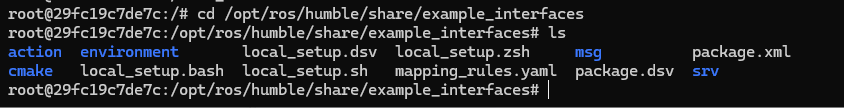
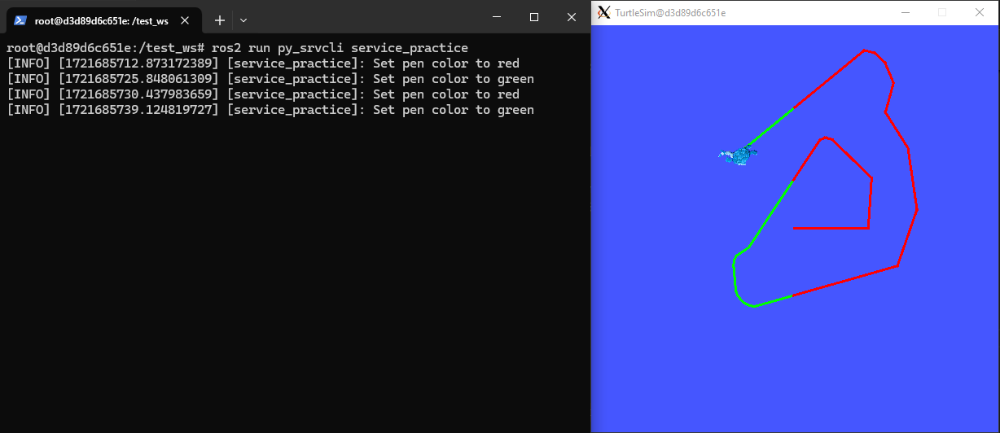
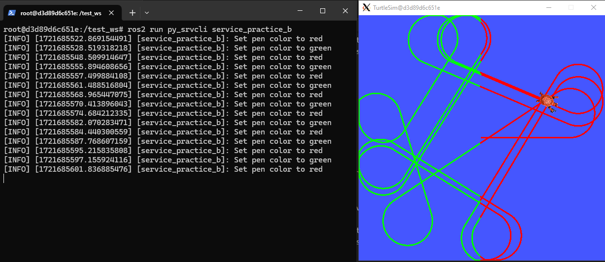
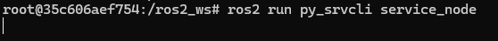
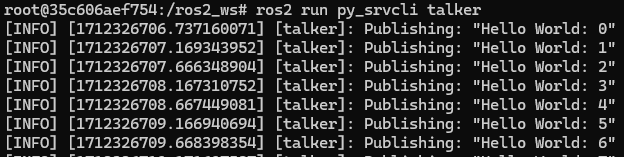
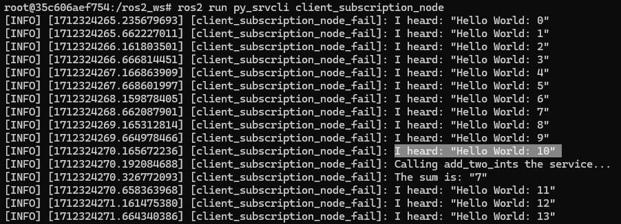
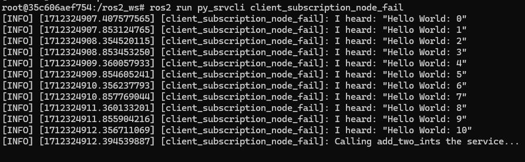
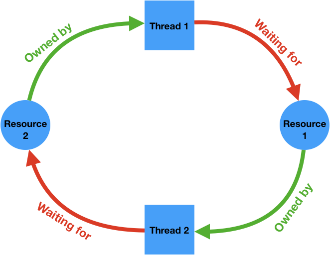

Writing service and client. Python
==========================

.. _Writing service client python:

This sections shows how nodes can communicate with each other through services. The node that sends a request is called the client node, while the node that responds to the request sending the response is called the service node. The programs for the client and service nodes will be developed in python.  

Setup for working with services
------------------------

Make sure to be in a `brand new terminal`_ window and no ROS command is currently running. 

.. _`brand new terminal`: https://ros2course.readthedocs.io/en/latest/Installation%20and%20software%20setup.html#running-a-docker-container

Create a new package. This package should be contained in the ``ros2_ws`` workspace, within its ``/src`` folder. The name provided to this new package will be ``py_srvcli``.

.. code-block:: console

   ros2 pkg create --build-type ament_python --license Apache-2.0 py_srvcli --dependencies rclpy example_interfaces

The ``--dependencies`` argument will automatically add the necessary dependency lines to ``package.xml``. In this case, ``example_interfaces`` is the package that includes the ``AddTwoInts.srv`` file that is needed to structure the requests and responses of this example. See below its data structure:

.. code-block:: console

   int64 a
   int64 b
   ---
   int64 sum

This package of name ``example_interfaces`` resides in the default installation of ROS 2. It occurs the same as with the ``geometry_msgs`` package when trying to use the ``Twist`` type of message in any ROS 2 script. These packages come installed by default with ROS 2. One can look for them, openning a new Docker session and navigating the following path:

.. code-block:: console

   /opt/ros/humble/share/example_interfaces

Finally, for more reference on package creation consult the `package creation`_ section.

.. _package creation: https://ros2course.readthedocs.io/en/latest/Configuring%20environment.html#creating-and-configuring-a-package

Writing the service node. Python
------------------------

Inside this package, specifically in ``py_srvcli/py_srvcli`` create a python script, name it ``service_node.py``.

Copy this content into the new python script. 

.. code-block:: python

   from example_interfaces.srv import AddTwoInts

   import rclpy
   from rclpy.node import Node

   class MinimalService(Node):

      def __init__(self):
         super().__init__('service_node')
         self.srv = self.create_service(AddTwoInts, 'add_two_ints', self.add_two_ints_callback)

      def add_two_ints_callback(self, request, response):
         response.sum = request.a + request.b
         self.get_logger().info('Incoming request\na: %d b: %d' % (request.a, request.b))

         return response

   def main():
      rclpy.init()

      minimal_service = MinimalService()

      rclpy.spin(minimal_service)

      rclpy.shutdown()

   if __name__ == '__main__':
      main()

1. Service node, python. Examining the code. 
~~~~~~~~~~~~~~~~~~~~~~~~~~~~~~~~~~~~~~~~

The first lines correspond to import libraries.

.. code-block:: python

   from example_interfaces.srv import AddTwoInts

   import rclpy
   from rclpy.node import Node

- ``from example_interfaces.srv import AddTwoInts`` imports the ``AddTwoInts`` service type from the ``example_interfaces`` package. 
- ``rclpy`` is a Python client library for ROS 2. It provides Python bindings for the ROS 2 middleware, enabling developers to write ROS 2 nodes and applications using the Python programming language.
- ``from rclpy.node import Node`` imports the ``Node`` class from the ``rclpy.node`` module.

Next, a class is created:

.. code-block:: python
 
   class MinimalService(Node):

      def __init__(self):
         super().__init__('service_node')
         self.srv = self.create_service(AddTwoInts, 'add_two_ints', self.add_two_ints_callback)

      def add_two_ints_callback(self, request, response):
         response.sum = request.a + request.b
         self.get_logger().info('Incoming request\na: %d b: %d' % (request.a, request.b))

         return response

- A class of name ``MinimalService`` is created and it inherits from class ``Node``.
- The constructor of the class is defined, for that, ``super().__init__('service_node')`` is issued. This is a call to the ``Node`` class' constructor function and at the same time, it assigns a node name of: ``service_node``.
- An attribute of name ``srv`` is created and stores the result of ``create_service()``, which creates a service of type ``AddTwoInts`` with name ``add_two_ints`` and that will execute the ``self.add_two_ints_callback`` function every time the service is invoked. This is the general structure of the ``create_service`` function:

.. code-block:: console
   
   create_service(<srv_type>, <srv_name>, <callback>, *, qos_profile=<rclpy.qos.QoSProfile object>, <callback_group=None>)

- Next, the definition of the callback function is coded. It receives as parameters, the request and response of the service.
- Inside the callback function, it is performed the addition of the two requests variables and displays a message through the terminal stating the result of this sum. 
- Finally, it returns the response. 

Lastly, the main function is defined.

.. code-block:: python

   def main():
      rclpy.init()

      minimal_service = MinimalService()

      rclpy.spin(minimal_service)

      rclpy.shutdown()

   if __name__ == '__main__':
      main()

- First the ``rclpy`` library is initialized.
- A node is created by instantiating an object of the ``MinimalService`` class.
- ``rclpy.spin(minimal_service)`` starts the ROS 2 event loop for the specified node (``minimal_service``). The event loop is responsible for processing messages, handling callbacks, and maintaining the communication infrastructure of the ROS 2 system. 
- ``rclpy.shutdown()`` shuts down the ROS 2 system. It releases resources allocated by the ROS 2 middleware and cleans up the environment.

2. Service, python. Adding dependencies
~~~~~~~~~~~~~~~~~~~~~~~~~~~~~~~~~~~~~~~~~

Once the python script is ready, make sure the dependencies to run this script are correctly configured in the ROS 2 environment. Navigate to ``py_srvcli/package.xml`` and check that the dependecies are already added for this case, since at the moment of the package creation it was executed: ``--dependencies rclpy example_interfaces``.

.. code-block:: console

   <depend>rclpy</depend>
   <depend>example_interfaces</depend>

About the ``<depend>`` tags:

- This tag is a more general declaration of dependency. 
- It is used to specify both build-time and runtime dependencies. 
- ``<depend>`` includes both the dependencies needed for compilation and those needed at runtime.
- It encompasses a wider range of dependencies compared to ``<exec_depend>``.

3. Service, python. Adding an entry point
~~~~~~~~~~~~~~~~~~~~~~~~~~~~~~~~~~~~~~~~~~~

Navigate to ``py_srvcli/setup.py`` and add the following within the ``console_scripts`` brackets of the ``entry_points`` field:

.. code-block:: console

   entry_points={
         'console_scripts': [
                  'service_node = py_srvcli.service_node:main',
         ],
   },

4. Build service node and run
~~~~~~~~~~~~~~~~~~~~~~~~~~~~~~~
At this point the script is created, the dependencies configured and the entry point correclty setup. 

Open a `brand new terminal`_, make sure that no other ROS 2 command is currently running, navigate to the workspace directory and execute either of these two commands:

.. code-block:: console
   
   colcon build --packages-select py_srvcli
   colcon build --symlink-install

The first command will build only the ``py_srvcli`` package; it will build it by copying the built artifacts (binaries, libraries, headers, etc.) into an install directory. While the second one, will build all the packages contained in the workspace, but rather than copying the built artifacts, it will use symbolic links to these ones. The way the built artifacts are handled results in having to execute ``colcon build`` every time a change is performed in the source code to see their effects, while with ``colcon build --symlink-install``, every time a change is performed in the source code, it will not be necessary to perform the building operation afterwards. 

A message similar to this one, should be expected after building the workspace with ``colcon build --packages-select py_srvcli``:

.. code-block:: console
   
   Starting >>> py_srvcli
   Finished <<< py_srvcli [3.62s]

   Summary: 1 package finished [4.95s]

Now, source the setup file:

.. code-block:: console
   
   source install/setup.bash

For more reference on sourcing the setup file, see `sourcing the setup file`_.

.. _sourcing the setup file: https://ros2course.readthedocs.io/en/latest/Configuring%20environment.html#workspace-sourcing

And run the publisher node that was recently created. 

.. code-block:: console
   
   ros2 run py_srvcli service_node

As a result, nothing will be printed in the terminal window. This is because the service itself has been initiated but no other node is calling that service. 

`Open a new terminal`_ and execute:

.. _open a new terminal: https://ros2course.readthedocs.io/en/latest/Installation%20and%20software%20setup.html#opening-a-new-terminal-for-the-docker-container

.. code-block:: console
   
   ros2 service list

This will result in something similar to:

.. code-block:: console
   
   /add_two_ints
   /service_node/describe_parameters
   /service_node/get_parameter_types
   /service_node/get_parameters
   /service_node/list_parameters
   /service_node/set_parameters
   /service_node/set_parameters_atomically

Here, it can be seen that the service that was created in the ``service_node.py`` python script, is indeed present and ready to be called, that is: ``/add_two_ints`` service.

Now, to have things clear execute the following:

.. code-block:: console
   
   ros2 node list

Which will output:

.. code-block:: console
   
   /service_node

Which is expected, as this is the name that was provided to the node when coding the ``service_node.py`` python program.

Finally, call the ``/add_two_ints`` service. Execute:

.. code-block:: console
   
   ros2 service call /add_two_ints example_interfaces/srv/AddTwoInts "{a: 2, b: 3}"

This will result in:

.. code-block:: console

   requester: making request: example_interfaces.srv.AddTwoInts_Request(a=2, b=3)

   response:
   example_interfaces.srv.AddTwoInts_Response(sum=5)

The service that was created was just called directly from the terminal. 

What is going to be performed next, is to consume this service through a node. Its coding will be shown below.

Client node in python
-------------------------

Navigate to ``py_srvcli/py_srvcli`` and create a python script called: ``client_node.py``. Copy this content into the new python script. 

.. code-block:: python
   
   import sys

   from example_interfaces.srv import AddTwoInts
   import rclpy
   from rclpy.node import Node

   class MinimalClientAsync(Node):

      def __init__(self):
         super().__init__('client_node')
         self.cli = self.create_client(AddTwoInts, 'add_two_ints')
         while not self.cli.wait_for_service(timeout_sec=1.0):
               self.get_logger().info('service not available, waiting again...')
         self.req = AddTwoInts.Request()

      def send_request(self, a, b):
         self.req.a = a
         self.req.b = b
         self.future = self.cli.call_async(self.req)
         rclpy.spin_until_future_complete(self, self.future)
         return self.future.result()

   def main():
      rclpy.init()

      minimal_client = MinimalClientAsync()
      response = minimal_client.send_request(int(sys.argv[1]), int(sys.argv[2]))
      minimal_client.get_logger().info(
         'Result of add_two_ints: for %d + %d = %d' %
         (int(sys.argv[1]), int(sys.argv[2]), response.sum))

      minimal_client.destroy_node()
      rclpy.shutdown()

   if __name__ == '__main__':
      main()

1. Service client, python. Examining the code. 
~~~~~~~~~~~~~~~~~~~~~~~~~~~~~~~~~~~~~~~~~~

The first lines correspond to import libraries. These are the similar libraries as in the :ref:`service node example<1. Service node, python. Examining the code.>`. 

.. code-block:: python
   
   import sys

   from example_interfaces.srv import AddTwoInts
   import rclpy
   from rclpy.node import Node

- ``import sys`` provides access to some variables used or maintained by the Python interpreter and to functions that interact strongly with the interpreter.

Next, a class is created:

.. code-block:: python
   
   class MinimalClientAsync(Node):

      def __init__(self):
         super().__init__('client_node')
         self.cli = self.create_client(AddTwoInts, 'add_two_ints')
         while not self.cli.wait_for_service(timeout_sec=1.0):
               self.get_logger().info('service not available, waiting again...')
         self.req = AddTwoInts.Request()

      def send_request(self, a, b):
         self.req.a = a
         self.req.b = b
         self.future = self.cli.call_async(self.req)
         rclpy.spin_until_future_complete(self, self.future)
         return self.future.result()

- The constructor of the ``MinimalClientAsync`` class issues the ``create_client()`` function, which receives as arguments: ``AddTwoInts``, as the service type and ``add_two_ints``, as the service name. The structure for the ``create_client()`` function is given by:

.. code-block:: console
   
   create_client(<srv_type>, <srv_name>, *, qos_profile=<rclpy.qos.QoSProfile object>, <callback_group=None>)

- The execution of the program is stopped for 1 second, if the service of interest (``add_two_ints``) is not responding, then a "service not available" message will be printed in the terminal.
- An instance of the request message type ``AddTwoInts.Request()`` is intialized in ``self.req``.
- Then a method is created: ``send_request()``. This performs:
  - Sends a request to the ``add_two_ints`` service with two integers ``a`` and ``b``.
  - It sets the ``a`` and ``b`` fields of the request message.
  - It sends the request asynchronously using ``self.cli.call_async()``. This means that ``call_async()`` does not block the program's execution while waiting for a response. Instead, it immediately returns a ``Future`` object.
    - A ``Future`` object represents the result of an asynchronous operation. It can be used to check the status of the operation or retrieve the result once it is complete. When ``call_async()`` is called, it returns a ``Future`` object that will eventually hold the response from the service. See below, some info extracted from its documentation: https://docs.ros2.org/latest/api/rclpy/api/services.html#rclpy.client.Client.call_async.
  
      .. image:: images/call_asyncDocs.png
         :alt: the call_async function documentation.
    
    - ``rclpy.spin_until_future_complete(self, self.future)`` is a blocking call that keeps the node running and processing until the ``Future`` object is complete. It effectively waits for the service response to be received and the ``Future`` to be set with the result.
    - Finally, ``self.future.result()`` retrieves the result of the asynchronous operation once it is complete. If the service call was successful, this will return the response from the ``AddTwoInts`` service, which includes the sum of the two integers.

Lastly, the main function, it initializes the ``rclpy`` library, creates the client node, sends the corresponding request, explicitely destroys the node when a command of stoppage is issued from the terminal window, and shuts down the ROS 2 system.

.. code-block:: python

   def main():
      rclpy.init()

      minimal_client = MinimalClientAsync()
      response = minimal_client.send_request(int(sys.argv[1]), int(sys.argv[2]))
      minimal_client.get_logger().info(
         'Result of add_two_ints: for %d + %d = %d' %
         (int(sys.argv[1]), int(sys.argv[2]), response.sum))

      minimal_client.destroy_node()
      rclpy.shutdown()

- First the ``rclpy`` library is initialized.
- A node is created by instantiating an object of the ``MinimalClientAsync`` class.
- It sends a request to the service using command-line arguments passed to the script.
- It logs the result of the service call by printing a message to the terminal, that specifies the result of the sum. 
- It destroys the node using ``minimal_client.destroy_node()``.
- Finally, ``rclpy.shutdown()`` shuts down the ROS 2 system. It releases resources allocated by the ROS 2 middleware and cleans up the environment.

2. Service client, python. Adding dependencies
~~~~~~~~~~~~~~~~~~~~~~~~~~~~~~~~~~~~~~~~~~

As the libraries to use in this program are exactly the same as in the publisher node, then no new dependency should be added. If, for some reason, it were going to be used a new library in the subscriber node, then that library should be added as a dependecy in the ``py_srvcli/package.xml`` file.

3. Service client, python. Adding an entry point
~~~~~~~~~~~~~~~~~~~~~~~~~~~~~~~~~~~~~~~~~~~~

Navigate to ``py_srvcli/setup.py`` and add the following within the ``console_scripts`` brackets of the ``entry_points`` field:

.. code-block:: console
   
   'client_node = py_srvcli.client_node:main'

This ``entry_points`` field should be remain like this:

.. code-block:: console

   entry_points={
      'console_scripts': [
         'service_node = py_srvcli.service_node:main',
         'client_node = py_srvcli.client_node:main'
      ],
   },

4. Build service client node and run
~~~~~~~~~~~~~~~~~~~~~~~~~~~~~~~~

At this point the script is created, the dependencies configured and the entry point correclty setup. 

Open a `brand new terminal`_, make sure that no other ROS 2 command is currently running, navigate to the workspace directory and execute:

.. code-block:: console
   
   colcon build --packages-select py_srvcli

Now, source the setup file:

.. code-block:: console
   
   source install/setup.bash

For more reference on sourcing the setup file, see `sourcing the setup file`_.

And run the following: 

.. code-block:: console
   
   ros2 run py_srvcli client_node 3 5

The ouput will be something similar to:

.. code-block:: console

   [INFO] [1712310272.148298284] [client_node]: service not available, waiting again...
   [INFO] [1712310273.188070919] [client_node]: service not available, waiting again...
   ...

This is expected, as the service itself is not running and the current node is trying to consume a service that does not exist yet. 

`Open a new terminal`_ and execute the ``service_node`` node:

.. code-block:: console
   
   ros2 run py_srvcli service_node

Once, this node is run, the service becomes available and in the terminal where ``client_node`` was executed it can be seen this otuput:

.. code-block:: console

   [INFO] [1712310438.283855221] [client_node]: Result of add_two_ints: for 3 + 5 = 8

Practice 
---------

Have ``trutlesim_node`` and ``turtle_teleop_key`` nodes running. Create a new node called ``service_practice`` that performs:

- When the turtle crosses the point x = 5.5 to the right of the screen, its drawing line should change of color to be red.
- When the turtle position is to the left of the screen (its x position is lower than 5.5), its drawing line should become green.
- Print in the terminal the color that is using.

See image below for an example of the results:

Optional
~~~~~~~~
Have only the ``trutlesim_node`` node running. Create a new node called ``service_practice_b`` that performs:

- Make the turtlebot move accross the window with linear velocity 1.
- When the turle is close to any wall of the screen, make it turn so it avoids crashing with it. Slow the movement of the turtle reducing its linear velocity to 0.5.
- When the turtle crosses the point x = 5.5 to the right of the screen, its drawing line should change of color to be red.
- When the turtle position is to the left of the screen (its x position is lower than 5.5), its drawing line should become green.
- Print in the terminal the color that is using.

See image below for an example of the results:

A must-see for completing the practice
~~~~~~~~~~~~~~~~~~~~~

The use of ``rclpy.spin_until_future_complete()`` might have entered in conflict with ``rclpy.spin()`` in the ``service_practice`` program while trying to accomplish the practice. For that, imagine a relatively simpler problem to address:

- In a `new terminal`_, run the service node ``service_node``. This will make the ``add_two_ints`` service available for use. 

.. _new terminal: https://ros2course.readthedocs.io/en/latest/Installation%20and%20software%20setup.html#opening-a-new-terminal-for-the-docker-container

- `Open a new terminal`_, and run a talker node like has been seen in a `previous part`_ of the course. Recall to follow all the required steps (adding depencies, adding the entry point, etc.) to have this node available to use in this package.

.. _`previous part`: https://ros2course.readthedocs.io/en/latest/Writing%20publisher%20and%20subscriber%20nodes.%20Python.html#build-publisher-node-and-run

With these nodes running, imagine the statement of the problem is to create a node that:

 - Subscribes to the topic called ``topic``.
 - Prints the messages that arrive to the topic (just like `this previous program`_).
 - When the message: ``"Hello World: 10"`` arrives, it calls the ``add_two_ints`` service and prints in the terminal the sum of ``5`` and ``2``. 

See the expected result below.

.. _`this previous program`: https://ros2course.readthedocs.io/en/latest/Writing%20publisher%20and%20subscriber%20nodes.%20C%2B%2B.html#build-subscriber-node-and-run

This is a first version of this program. Check the usage of ``rclpy.spin_until_future_complete()``.

.. code-block:: python

   import sys
   from example_interfaces.srv import AddTwoInts
   import rclpy
   from rclpy.node import Node
   from std_msgs.msg import String

   class NodeSubscriberClient(Node):

      def __init__(self):
         super().__init__('client_subscription_node_fail')
         self.subscription_ = self.create_subscription(
               String,
               'topic',
               self.listener_callback,
               10)
         self.subscription_  # prevent unused variable warning
         self.cli = self.create_client(AddTwoInts, 'add_two_ints')
         while not self.cli.wait_for_service(timeout_sec=1.0):
               self.get_logger().info('service not available, waiting again...')
         self.req = AddTwoInts.Request()

      def send_request(self, a, b):
         self.req.a = a
         self.req.b = b
         self.future = self.cli.call_async(self.req)
         rclpy.spin_until_future_complete(self, self.future)
         return self.future.result()
      
      def listener_callback(self, msg):
         self.get_logger().info('I heard: "%s"' % msg.data)
         if (msg.data == "Hello World: 10"):
               self.get_logger().info('Calling add_two_ints the service...')
               res = self.send_request(2,5)
               self.get_logger().info('The sum is: "%s"' %res)

   def main():
      rclpy.init()

      sub_client_node = NodeSubscriberClient()
      rclpy.spin(sub_client_node)
      sub_client_node.destroy_node()
      rclpy.shutdown()

   if __name__ == '__main__':
      main()

This will result in an unexpected behavior of the program, the program stops rigth after receiving the ``"Hello World: 10"`` message.

This occurs because ``spin_until_future_complete()`` function is called within the callback function ``listener_callback()``. This can lead to a deadlock situation, where the code waits indefinitely for the service call to complete while being stuck in the callback function. 

Hence, for this situation we have:

- Thread 1: This is the main thread (``rclpy.spin()``), which is responsible for spinning the node and invoking the ``listener_callback`` when a message is received. This thread "waits" for the ``listener_callback`` function to finish its execution.
- Thread 2: The one issued by ``spin_until_future_complete()``, it will wait for the service to be finished. It creates a thread similar to ``rclpy.spin()``, hence it will check for incoming messages and call the appropriate callbacks of the node. In this way, the "Thread 2" whose main interest is to catch the response of the service, will also depend on the execution of the ``listener_callback``, which at the same time depends on the response from the service, creating the deadlock loop. 

Hence, to avoid this issue, the service call must be handled in the following manner:

.. code-block:: python

   import sys

   from example_interfaces.srv import AddTwoInts
   import rclpy
   from rclpy.node import Node
   from std_msgs.msg import String

   class NodeSubscriberClient(Node):

      def __init__(self):
         super().__init__('client_subscription_node_fail')
         self.subscription_ = self.create_subscription(
               String,
               'topic',
               self.listener_callback,
               10)
         self.subscription_  # prevent unused variable warning
         self.cli = self.create_client(AddTwoInts, 'add_two_ints')
         while not self.cli.wait_for_service(timeout_sec=1.0):
               self.get_logger().info('service not available, waiting again...')
         self.req = AddTwoInts.Request()

      def send_request(self, a, b):
         self.req.a = a
         self.req.b = b
         self.future = self.cli.call_async(self.req)
         # rclpy.spin_until_future_complete(self, self.future)
         # return self.future.result()
         return self.future
      
      def listener_callback(self, msg):
         self.get_logger().info('I heard: "%s"' % msg.data)
         if (msg.data == "Hello World: 10"):
               self.get_logger().info('Calling add_two_ints the service...')
               future = self.send_request(2,5)
               future.add_done_callback(self.callback_sum)
      
      def callback_sum(self, future):
         if future.result() is not None:
               res = future.result()
               self.get_logger().info('The sum is: "%s"' % res.sum)
         else:
               self.get_logger().warning('Service call failed')

   def main():
      rclpy.init()

      sub_client_node = NodeSubscriberClient()
      rclpy.spin(sub_client_node)
      sub_client_node.destroy_node()
      rclpy.shutdown()

   if __name__ == '__main__':
      main()

See that ``spin_until_future_complete()`` function is not being used anymore to avoid the deadlock loop. Instead, asynchronous service calls are used properly and a separate method handles the service call asynchronously. This method was named ``callback_sum()``. Below, there is a detailed explanation of what is happening:

- First, the ``send_request()`` function works fine and finishes its execution returning an object result (the ``Future`` object) of sending the request asynchronously using ``self.cli.call_async()``. 
- This objected returned by ``send_request()`` is stored in a ``Future`` type variable. Later, a callback is attached to this object, the ``callback_sum`` method. But this callback will only be executed when the ``Future`` object is done; that is why the function ``add_done_callback()`` is being used. 
- Next, the callback method. Any callback method attached to the ``add_done_callback()`` function will be invoked with the ``Future`` object as its only argument. And it simply evaluates the result of the ``Future`` object, printing log messages or warning messages depending on the service call. 

Do consider this situation when working with ``rclpy.spin()`` and ``spin_until_future_complete()`` as it will cause unexpected issues if not handled appropriately. 

